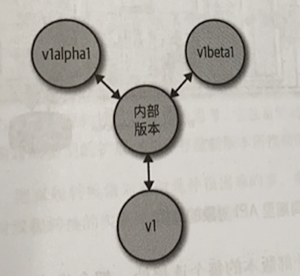

# k8s Core Concept

## 简介

### 特性

k8s 用于管理分布式、容器化应用，它提供了零停机时间部署、自动回滚、缩放和自愈等功能。k8s 提供了一个抽象层，使其可以在物理或 VM 环境中部署容器应用，提供以容器为中心的基础架构。其设计理念是为了支撑**横向扩展**，即调整应用的副本数以提高可用性。k8s的具体特点如下：

- 环境无依赖：同一个应用支持公有云、私有云、混合云、多云部署。
- 面向切片：通过插件化，使所用功能都以插件部署形式动态加载，尤其针对复杂度较高的应用。
- 声明式：平台自身通过自动化方式达到预期状态。

## 架构

k8s 遵从 C/S 架构，集群分为 master 和 node 2 部分，master 作为控制面节点，node 作为承载业务的工作节点。


### Master

Master 可以多节点实现高可用，默认情况下 1 个节点也能完成所有工作。它首先负责管理所有 node ，负责调度 pod 在哪些节点上运行，并且负责控制集群运行过程中的所有状态。所有控制命令都由 master 接收并处理，其核心组件包括：

- etcd：保存了整个集群的状态。
- [kube-apiserver](kube-apiserver/README.md)：集群的 REST 接口，是集群控制的入口。提供了资源操作的唯一入口，并提供认证、授权、访问控制、API 注册和发现等机制。kube-apiserver 负责将 k8s 的 GVR “资源组/资源版本/资源”以 REST 的形式对外暴露并提供服务。k8s 集群中的所有组件都通过 kube-apiserver 操作资源对象。kube-apiserver 也是集群中唯一与etcd 集群交互的核心组件，k8s 将所有数据存储至 etcd 集群中前缀为 /registry 的目录下。
- [kube-controller-manager](kube-controller-mgr/README.md)：集群所有资源对象的自动化控制中心，负责维护集群的状态，比如故障检测、自动扩展、滚动更新等。kube-controller-manager 的目的是确保 k8s 的实际状态收敛到所需状态，它会及时发现并执行自动化修复流程，确保集群始终处于预期的工作状态。kube-controller-manager 提供了一些默认的 controller，每个 controller 通过 kube-apiserver 的接口实时监控整个集群的每个资源对象的状态。当发生各种故障而导致集群状态发生变化时，会尝试将系统状态恢复到期望状态。
- [kube-scheduler](kube-scheduler/README.md)：集群 pod 资源对象的调度服务，负责资源的调度，按照预定的调度策略将 pod 调度到相应的机器上。kube-scheduler 负责在 k8s 集群中为一个 pod 资源对象找到合适的节点并在该节点上运行，kube-scheduler 每次只调度一个 pod。

### Node

Node 是 k8s 集群的工作节点，负责管理本 node 上的所有容器，监控并上报所有 pod 的运行状态。node 节点的工作由 master 进行分配，其核心组件包括：

- [kubelet](kubelet/README.md)：负责维持容器的生命周期，包括容器的创建、删除、启停等任务，与 master 进行通信。同时也负责 runtime（CRI）、Volume（CSI）和网络（CNI）的管理。kubelet 用于管理节点，运行在每个 k8s 的 node 节点上。kubelet 接收、处理、上报 kube-apiserver 下发的任务。kubelet 启动时会先向 kube-apiserver 注册自身节点的信息。后续当 kube-apiserver 下发如创建 pod 等信息，kubelet 负责本节点上的 pod 资源对象的管理，如 pod 资源对象的创建、修改、监控、删除、驱逐等。同时，kubelet 会定期监控所在节点的资源使用情况并上报给 kube-apiserver，这些数据可以帮助 kube-scheduler 为 pod 资源对象预选节点。kubelet 也会对所在节点的容器和镜像做清理工作，保证节点上的镜像不会暂满磁盘空间、删除容器从而释放相关资源。
- Container runtime：它接收 kubelet 的指令，负责镜像管理以及 pod 和容器的真正运行（CRI），默认的容器运行时为 Docker。
- [kube-proxy](kube-proxy/README.md)：负责 k8s 中服务的通讯及负载均衡，如为 Service 提供 cluster 内部的服务发现和负载均衡。kube-proxy 作为 node 上的网络代理，它监控 kube-apiserver 的服务和端点资源变化，通过 iptables/IPVS 等配置负载均衡，为一组 pod 提供统一的流量转发和负载均衡功能。kube-proxy 对某个 IP:Port 的请求，负责将其转发给专用网络上的相应服务。

### Add-ons组件

除了核心组件，还有一些推荐的 Add-ons：

- [kube-dns](kube-dns/README.md)：负责为整个集群提供 DNS 服务
- Ingress Controller：为服务提供外网入口
- Heapster：提供资源监控
- Dashboard：提供 GUI
- Federation：提供跨可用区的集群
- Fluentd-elasticsearch：提供集群日志采集、存储与查询


### 客户端

- kubectl：kubectl 是 k8s 的 CLI，用户可以通过 kubectl 以命令交互的方式对 kube-apiserver 进行操作，通讯协议使用 HTTP/JSON。kubectl 发送相应的 HTTP 请求，请求由 kube-apiserver 接收、处理并将结果反馈给 kubectl，kubectl 接收到相应并展示结果。
- [client-go](../20_client-go/README.md)：client-go 是从 k8s 的代码中独立抽离出来的包，并作为官方提供的 Go 的 SDK 发挥作用。在大部分基于 k8s 做二次开发的程序中，建议通过 client-go 来实现与 kube-apiserver 的交互过程。因为 client-go 在 k8s 系统上做了大量优化，k8s 的核心组件（如 kube-scheduler、kube-controller-manager 等）都通过 client-go 与 kube-apiserver 进行交互。

## 数据结构

k8s 支撑多个 group，每个 group 支持多个 version，每个 version 又支持多个 resource。

我们常提到的 schema 指 GVR、GV、GR、GVK、GK 等数据结构

### Group 资源组

k8s 定义了许多 group，这些 group 按不同的功能将 resource 进行划分，但也支持一个 resource 属于不同的group，例如`apis/apps/v1/deployments`。另外，有些资源因为历史遗留原因是没有 group 的，被称为 core group，例如 `api/v1/pods`。

group 的主要功能包括：

- 将资源划分 group 后，允许以 group 为单元进行启用/禁用。
- 每个 group 有自己的 version，方便以 group 为单元进行迭代升级。

#### 数据结构

- Name：group 的名字。
- Versions：group 下所支持的版本。
- PreferredVersion：推荐使用的version。

### Version 资源版本

每个 group 可以拥有不同的 version，在 YAML 中的 Version 其实就是 “group+version”。k8s 的 version 分为了 Alpha、Beta、Stable，依次逐步成熟，在默认情况下 Alpha 的功能会在生产环境被禁用。

#### 数据结构

- Versions：所支持的所有版本。

### Kind 资源种类

Go 内部的结构体，用于描述后续介绍的 resource 的种类。k8s 中的资源在 Go 内部是基于某种 kind 来实现的。根据 kind 的不同，resource 中具体字段也会有所不同，不过他们都用基本相同的结构。不同的 kind 被划分到不同的 group 中，并有着不同的 version。

#### GVK

从 REST 的角度来表示 kind 资源类型

在编码过程中，k8s 的 resource 都是以 Go 的结构体存储的。由于不同版本的 kind 的结构体存在差异，如果只用 kind 则无法获取具体版本的结构体。因此需要 GVK 这 3 个信息才能准确确定一个 kind，并且通过后续介绍的 scheme 获取 GVK 对应的 Go 结构体。

#### scheme 注册表

实现 GVK 与 Go 结构体之间的映射。

k8s 有众多的资源类型，这些资源类型需要统一的注册、存储、查询和管理。scheme 是 k8s 中的注册表，目前 k8s 中的所有资源类型（GVK）都需要注册到 scheme 中，用于建立 **Golang 结构体与 GVK 间的映射关系**。目前 k8s scheme 支持 UnversionedType 和 KnownType（也被直接称为 Type） 两种资源类型的注册。

scheme 资源注册表的数据结构主要由 4 个 map 组成：

- gvkToType：
- typeToGVK：
- unversionedTypes：
- unversionedKinds：

在祖册资源类型时，会根据 Type 的类型同时添加到这 4 个 map 中。

### Resource 资源

resource 是 k8s 的核心概念，k8s 整个体系都是围绕着 resource 构建的。k8s 的本质就是对 resource 的控制，包括注册、管理、调度并维护资源的状态。目前 k8s 支持 8 种对 resource 的操作，分别是 create、delete、delectcollection、get、list、patch、update、watch。

#### Resource Object 资源对象

Resource 被实例化后会表现为一个 resource object 资源对象。


#### Resource/Resource Object/Kind

Kind 是对应了 Go 内部结构体，可以认为是一种类型。而 resource 是从外部来看待的 k8s 自身的资源。


#### GVR

GVR（GroupVersionResource）：资源也有分组和版本号，具体表现形式为 `group/version/resource/subresource`，如 deployments 对应  /apis/apps/v1/namespaces/ns1/deployments。

#### RESTMapping

将 GVK 映射到 GVR 的过程被称为 RESTMapping


#### resource 版本转换

resource 可以有多个版本，为了让一个 resource 的多个版本共存，kube-apiserver 需要把 resource 在多个版本间进行转换。为了避免 NxN 的复杂度，kube-apiserver 采用了 internal 版本作为中枢版本，可以用作每个版本与之互转的中间版本。



##### External vs. Internal

在 k8s 中，每个资源至少有 External 和 Internal 2 个 version：

- External：对外暴露给用户所使用的 resource，其代码在`pkg/apis/group/version/`目录下。外部版本的资源是需要对外暴露给用户请求的接口，所以资源代码定义了 JSON、Proto 等 Tag，用于请求的序列化及反序列化。
- Internal：不对外暴露，仅在 kube-apiserver 内部使用。Internal 常用于资源版本的转换（不同的 external 资源版本通过 internal 进行中转），如将 v1beta1 转换为 v1 的路径为 v1beta1 --> internal --> v1。其代码在 `pkg/apis/group/__internal/`目录下。内部版本的资源部对外暴露，所以没有任何 JSON、Proto Tag。

##### 操作流程

external 和 internal version 的相互转换的函数需要事先初始化到 scheme 中。

- 用户发送特定版本请求（如 v1）
- apiserver 将请求（v1）解码（转换）成 internal 版本
- apiserver 对 internal 版本的请求进行准入检测和验证
- 用 internal 版本注册 scheme
- 将 internal 版本转换成目标版本（如 v2），用于读写入 Etcd
- 产生最终结果并编码成 v1 返回客户

#### 数据结构

- TypeMeta：
  - apiVersion：
  - kind：
- ObjectMeta：对应 YAML 中的 metadata 项
  - UID：
  - Name：
  - Namespace：
  - Labels：
- Spec：用户期望的状态
- Status：当前的状态

？？？

- Name：
- SingularName：resource的单数名称。
- Namespaced：是否有所属的namespace。
- Group：resource所在的group。
- Version：resource所在的version。
- Kind：resource的kind。
- Verbs：对该resource可操作的方法列表。
- ShortNames：resource的简称，如pod的简称为po。

#### 代码

- 包地址：`pkg/apis/group-name`
- internal 类型： `pkg/apis/group-name/types.go`，它不需要包含 JSON 和 protobuf 标签
- external 类型：`pkg/apis/group-name/version/types.go`
- 类型转换：
  - 自动由 conversion-gen 生成：`pkg/apis/group-name/zz_generated.conversion.go`
  - 手动编写：`pkg/apis/group-name/version/conversion.go`
- 默认值处理：
  - 自动由 defaulter-gen 生成：`pkg/apis/group-name/zz_generated.defaults.go`
  - 手动编写：`pkg/apis/group-name/version/defaults.go`
- 注册 scheme：`pkg/apis/group-name/install/install.go`


### apimachinery

`k8s.io/apimachinery` 包含了用于实现类似 k8s API 的通用代码，它并不仅限于容器管理，还可以用于任何业务领域的 API 接口开发。它包含了很多通用的 API 类型，如ObjectMeta、TypeMeta、GetOptions、ListOptions 等。

#### runtime.Object

runtime.Object 是 k8s 的通用资源类型，k8s 上的所有 resource object 实际上都是 Go 的一个 struct，它们都实现 runtime.Object 接口。runtime.Object 被设计为 Interface，作为 resource object 通用部分，该 interface 具体包含 2 个方法：

- GetObjectKind()：返回 GVK
- DeepCopyObject()：将数据结构克隆一份

#### interface.go

Serializer 包含序列化和反序列化操作。序列化将数据结构转换为字符串，而反序列化将字符串转换为数据结构，这样可以轻松地维护并存储、传输数据结构。Codec 包含编码器和解码器，它比 serializer 更为通用，指将一种数据结构转换为特定的格式的过程。所以，可以将 serializer 理解为一种特殊的 codec。

k8s 的 codec 包含 3 种 serializer：jsonSerializer、yamlSerializer、protobufSerializer。


## 代码

### Layout


### Option设置

- New Options：创建options
- Add Flags：将命令行flag添加到options结构体中
- Init logs：初始化日志
- Complete Options：填充默认参数到options
- Validate Options：验证options中所有参数


#### kube-apiserver Option示例


### 构建

编译Go代码生成二进制文件

#### 本地构建（推荐）

```shell
make all
```


#### 容器环境构建


#### Bazel环境构建


## 代码生成器

- 全局 Tag：定义在每个包的 doc.go 文件中，对整个包中的类型自动生成代码。
- 局部 Tag：定义在 Go 的类型声明上方，只对该类型自动生成代码。

### conversion-gen


### deepcopy-gen


### defaulter-gen


### go-bindata


### openapi-gen


## Lab

### scheme

- [scheme 操作](12_scheme/example.go)：首先定义了 2 中类型的 GV，KnownType 类型有 coreGV、extensionGV、coreInternalGV 对象，而 UnversionedType 类型有 Unversioned 对象。
通过 runtime.NewScheme 实例化一个新的 scheme，通过 AddXXXTypes 方法注册对象。


### runtime.object

- [runtime.object 操作](15_runtime-object/example.go)：实例化 pod 资源，再将 pod 资源转换为 runtime.object 资源，在将 runtime.object 资源转换回 pod 资源，最终通过 reflect 来验证转换是否等价。

