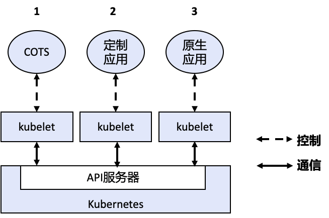
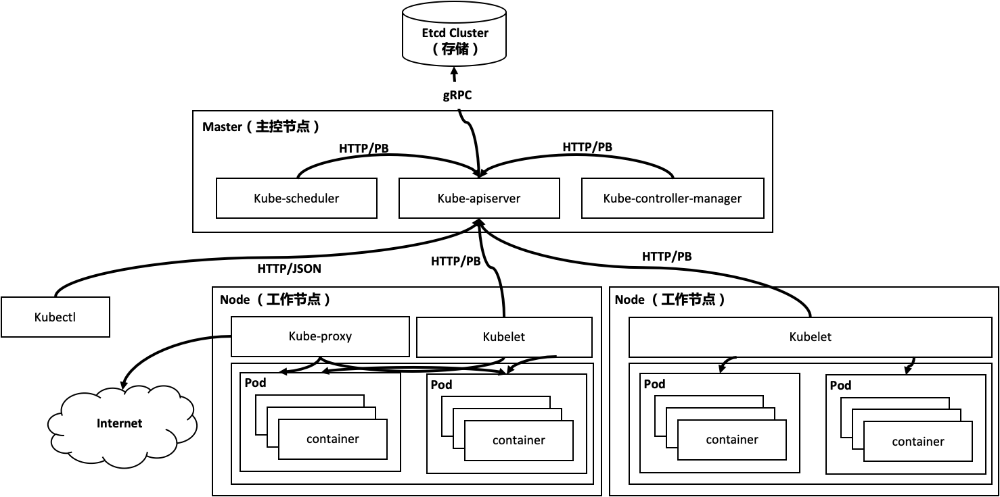
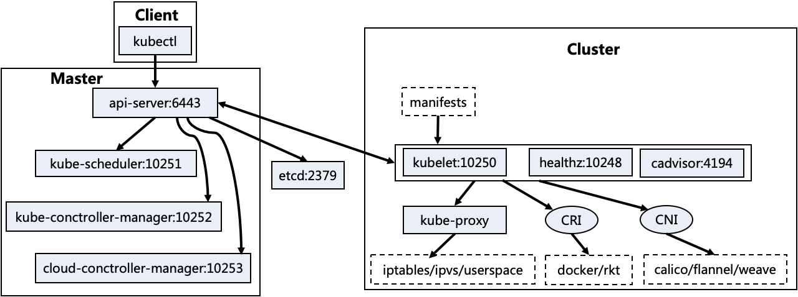
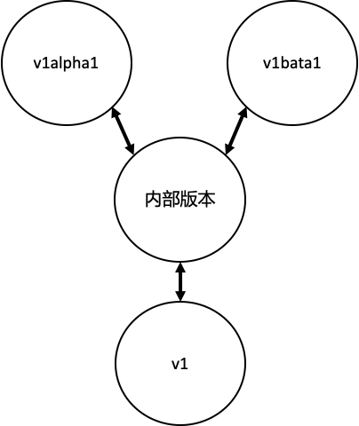
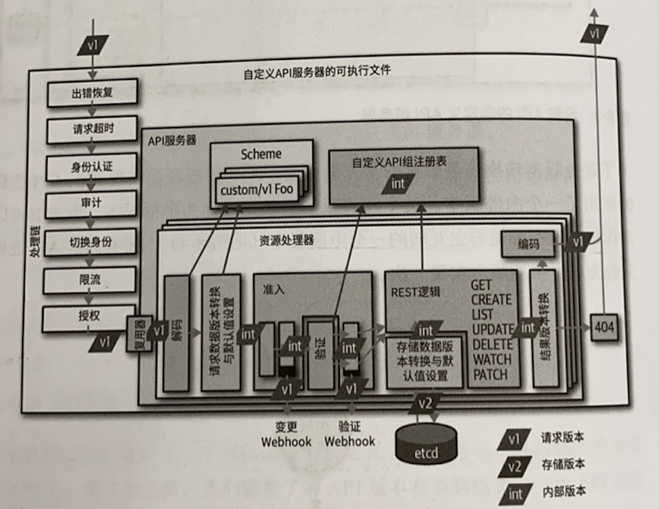
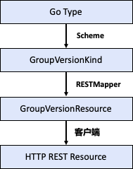
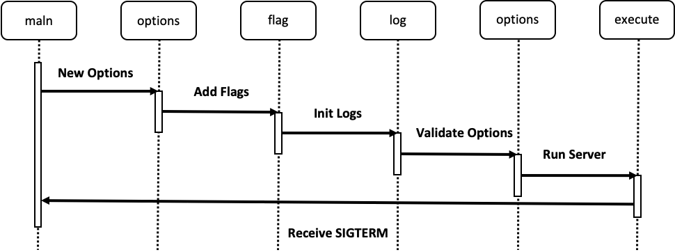

# 基本概念

k8s 用于管理分布式、容器化应用，它提供了零停机时间部署、自动回滚、缩放和自愈等功能。k8s 提供了一个抽象层，使其可以在物理或 VM 环境中部署容器应用，提供以容器为中心的基础架构。其设计理念是为了支撑**横向扩展**，即调整应用的副本数以提高可用性。k8s的具体特点如下：

- 环境无依赖：同一个应用支持公有云、私有云、混合云、多云部署。
- 面向切片（Aspect-oriented）：通过插件化使所用功能都以插件部署形式动态加载，尤其针对业务复杂度较高的应用。
- 声明式：平台自身通过自动化方式达到预期状态。

原生 k8s 应用指通过 kube-apiserver 进行交互，可直接查询、更新资源的状态的应用。这类应用强依赖 k8s，并在一定程度上可以直接调用 k8s 的 API 及相关资源。



## k8s扩展模式

扩展 K8s 的方式可以分为以下几类：

- 二进制插件：一段可执行的二进制程序，主要由 kubelet、kubectl 使用，例如 Flex 卷插件、网络插件。
- Webhook模式：另一种扩展模式是 K8s 作为客户端来访问外部服务。这种模式叫 Webhook 模式，被访问的外部服务叫做 Webhook Backend。
- Controller 控制器模式：还有一种扩展模式叫做控制器模式，控制器负责执行例行性任务来保证集群尽可能接近其期望状态，确保当前 status 与期望的 spec 保持一致。典型情况下控制器读取`.spec`字段，运行一些逻辑，然后修改`.status`字段。K8s 自身提供了大量的控制器，并由控制器管理器统一管理。It’s a controller’s job to ensure that, for any given object, the actualstate of the world matches the desired state in the object.  Each controller focuses on one  root Kind, but may interact with other Kinds. We call this process reconciling.

## 架构

k8s 遵从 C/S 架构，集群分为 master 和 node 2 部分，master 作为控制面节点，node 作为承载业务的工作节点。



### Master

Master 可以多节点实现高可用，默认情况下 1 个节点也能完成所有工作。它首先负责管理所有 node ，负责调度 pod 在哪些节点上运行，并且负责控制集群运行过程中的所有状态。所有控制命令都由 master 接收并处理，其核心组件包括：

- etcd：保存了整个集群的状态。
- [kube-apiserver](kube-apiserver/README.md)：提供 REST API 对 k8s 资源对象进行操作，它是集群的 REST 接口，是集群控制的入口。提供了资源操作的唯一入口，并提供认证、授权、访问控制、API 注册和发现等机制。kube-apiserver 负责将 k8s 的 GVR “资源组/资源版本/资源”以 REST 的形式对外暴露并提供服务，k8s 集群中的所有组件都通过 kube-apiserver 操作资源对象。kube-apiserver 也是集群中唯一与etcd 集群交互的核心组件，k8s 将所有数据存储至 etcd 集群中前缀为 /registry 的目录下。
- [kube-controller-manager](kube-controller-mgr/README.md)：集群所有资源对象的自动化控制中心，负责维护集群的状态，比如故障检测、自动扩展、滚动更新等。kube-controller-manager 的目的是确保 k8s 的实际状态收敛到所需状态，它会及时发现并执行自动化修复流程，确保集群始终处于预期的工作状态。kube-controller-manager 提供了一些默认的 controller，每个 controller 通过 kube-apiserver 的接口实时监控整个集群的每个资源对象的状态。当发生各种故障而导致集群状态发生变化时，会尝试将系统状态恢复到期望状态。
- [kube-scheduler](kube-scheduler/README.md)：集群 pod 资源对象的调度服务，负责资源的调度，按照预定的调度策略将 pod 调度到相应的机器上。kube-scheduler 负责在 k8s 集群中为一个 pod 资源对象找到合适的节点并在该节点上运行，kube-scheduler 每次只调度一个 pod。

### Node

Node 是 k8s 集群的工作节点，负责管理本 node 上的所有容器，监控并上报所有 pod 的运行状态。node 节点的工作由 master 进行分配，其核心组件包括：

- [kubelet](kubelet/README.md)：负责维持容器的生命周期，包括容器的创建、删除、启停等任务，与 master 进行通信。同时也负责 runtime（CRI）、Volume（CSI）和网络（CNI）的管理。kubelet 用于管理节点，运行在每个 k8s 的 node 节点上。kubelet 接收、处理、上报 kube-apiserver 下发的任务。kubelet 启动时会先向 kube-apiserver 注册自身节点的信息。后续当 kube-apiserver 下发如创建 pod 等信息，kubelet 负责本节点上的 pod 资源对象的管理，如 pod 资源对象的创建、修改、监控、删除、驱逐等。同时，kubelet 会定期监控所在节点的资源使用情况并上报给 kube-apiserver，这些数据可以帮助 kube-scheduler 为 pod 资源对象预选节点。kubelet 也会对所在节点的容器和镜像做清理工作，保证节点上的镜像不会暂满磁盘空间、删除容器从而释放相关资源。
- Container runtime：它接收 kubelet 的指令，负责镜像管理以及 pod 和容器的真正运行（CRI），默认的容器运行时为 Docker。
- [kube-proxy](kube-proxy/README.md)：负责 k8s 中服务的通讯及负载均衡，如为 Service 提供 cluster 内部的服务发现和负载均衡。kube-proxy 作为 node 上的网络代理，它监控 kube-apiserver 的服务和端点资源变化，通过 iptables/IPVS 等配置负载均衡，为一组 pod 提供统一的流量转发和负载均衡功能。kube-proxy 对某个 IP:Port 的请求，负责将其转发给专用网络上的相应服务。

### Add-ons

除了核心组件，还有一些推荐的 Add-ons：

- [kube-dns](kube-dns/README.md)：负责为整个集群提供 DNS 服务
- Ingress Controller：为服务提供外网入口
- Heapster：提供资源监控
- Dashboard：提供 GUI
- Federation：提供跨可用区的集群
- Fluentd-elasticsearch：提供集群日志采集、存储与查询



### 客户端

- kubectl：kubectl 是 k8s 的 CLI，用户可以通过 kubectl 以命令交互的方式对 kube-apiserver 进行操作，通讯协议使用 HTTP/JSON。kubectl 发送相应的 HTTP 请求，请求由 kube-apiserver 接收、处理并将结果反馈给 kubectl，kubectl 接收到相应并展示结果。
- [client-go](../20_controller/README.md)：client-go 是从 k8s 的代码中独立抽离出来的包，并作为官方提供的 Go 的 SDK 发挥作用。在大部分基于 k8s 做二次开发的程序中，建议通过 client-go 来实现与 kube-apiserver 的交互过程。因为 client-go 在 k8s 系统上做了大量优化，k8s 的核心组件（如 kube-scheduler、kube-controller-manager 等）都通过 client-go 与 kube-apiserver 进行交互。

## Schema

k8s 所管理的 API 资源支持多个 group，每个 group 支持多个 version，每个 version 又支持多种资源。我们常提到的 schema 指 GVR、GV、GR、GVK、GK 等，它定于在 apimachinery 中。

### GVR

GVR（GroupVersionResource）：资源也有分组和版本号，具体表现形式为 `group/version/resource/subresource`，如 deployments 对应  /apis/apps/v1/namespaces/ns1/deployments。以下会分别介绍 group、version、resource。

#### Group

k8s 定义了许多 group（资源组），这些 group 按不同的功能将 resource 进行划分，但也支持一个 resource 属于不同的 group，例如`apis/apps/v1/deployments`。另外，有些资源因为历史遗留原因是没有 group 的，被称为 core group，例如 `api/v1/pods`。

group 的主要功能包括：

- 将资源划分 group 后，允许以 group 为单元进行启用/禁用。
- 每个 group 有自己的 version，方便以 group 为单元进行迭代升级。

数据结构：

- Name：group 的名字。
- Versions：group 下所支持的版本。
- PreferredVersion：推荐使用的 version。

#### Version

每个 group 可以拥有不同的 version（资源版本），在 k8s YAML 中的 Version 其实就是 “group+version”。k8s 的 version 分为了 Alpha、Beta、Stable，依次逐步成熟，在默认情况下 Alpha 的功能会在生产环境被禁用。

数据结构：

- Versions：所支持的所有版本。

具体类型：

- alpha 级：随时会被舍弃，如 v1alpha1
- beta 级：后续可能会有不兼容变化，如 v1beta1
- stable 级：如 v1

#### Resource

API resource（REST）是 k8s 对外的核心概念，k8s 整个体系都是围绕着 resource 构建的。k8s 的本质就是对这些 REST resource 的控制，包括注册、管理、调度并维护资源的状态。目前 k8s 支持 8 种对 resource 的操作，分别是 create、delete、delectcollection、get、list、patch、update、watch。

resource 以小写复数的形式（如 pods）出现在 HTTP Endpoint 中，用于暴露 resource 的 CRUD 操作。

##### Resource Object

Resource 被实例化后会表现为一个 resource object 资源对象。

### GVK

k8s 的 group、version、resource 都是对外展示的 API 资源，而 kind 是 k8s 内部的资源表示形式，用于描述外部 API resource 对应的 k8s 内部资源形式，后续代码层面的 Go Type 都是基于某种 kind 来实现的。根据 kind 的不同，resource 中具体字段也会有所不同，不过他们都用基本相同的结构。不同的 kind 被映射到不同的 group 中，并有着不同的 version。

由于不同版本的 kind 的结构体存在差异，如果只用 kind 则无法获取具体版本的结构体。因此需要 GVK 这 3 个信息才能准确确定一个 kind，并且通过后续介绍的 scheme 获取 GVK 对应的 Go 结构体。但同一个 kind 结构体可以对应多个不同的 GVK。

#### Kind vs. Resource

kind 是对应了 k8s 内部使用，可以认为是用于 k8s 内部操作的资源。而 resource 是从外部来看的 k8s 的 API REST 资源。具体而言，resource 都会对应一个 HTTP Path，而 kind 是通过这个 HTTP Path 返回的对象的类型，用于 k8s 内部操作或 Etcd 存储。

### Type

Type 是代码层面 Go 内部的 struct 结构体，在编码过程中，k8s 的资源都是以 Go 的 Type struct 的形式存储的。资源定义通常放在 pkg/apis/group/version 中一个名为 xxx_types.go 的文件中，具体内容如下：

#### Object

schema=metadata+Spec+Status，如 Pod、Endpoint 等。

- TypeMeta：
  - apiVersion：
    - Group：resource 所在的 group。
    - Version：resource 所在的 version。
  - kind：resource 的 kind。
- ObjectMeta：对应 YAML 中的 metadata 项
  - UID：
  - Name：
  - Namespaced：是否有所属的 namespace。
  - ResourceVersion：
  - Labels：
  - Annotations：
  - SingularName：resource的单数名称。
  - Verbs：对该resource可操作的方法列表。
  - ShortNames：resource的简称，如pod的简称为po。
- Spec：用户期望的状态
- Status：当前的状态

// +kubebuilder:object:root：tells the object generator that this type representsa Kind. Then, the object generator generates an implementation of the[runtime.Object](https://pkg.go.dev/k8s.io/apimachinery/pkg/runtime?tab=doc#Object) interface.

#### ListObject

如 PodList、NodeList

- TypeMeta：
  - apiVersion
  - kind
- ListMeta：List的通用属性
- Items：资源列表

#### 版本转换

Type Go sturct 与 kind 对应，因为 kind 可以有多个版本，为了让一个 kind 的多个版本共存，kube-apiserver 需要实现 Go struct 多版本间的转换。为了避免 NxN 的复杂度，kube-apiserver 采用了 internal 版本作为中枢版本，可以用作每个版本与之互转的中间版本。



在 k8s 中，每个 Go struct 至少有 External 和 Internal 2 个版本：

- External：对外暴露给用户所使用的 kind，其 Type struct 定义在`pkg/apis/group/version/`目录下。外部版本的资源是需要对外暴露给用户请求的接口，所以资源代码定义了 JSON、Proto 等 Tag，用于请求的序列化及反序列化。
- Internal：不对外暴露，仅在 kube-apiserver 内部使用。Internal 常用于资源版本的转换（不同的 external 资源版本通过 internal 进行中转），如将 v1beta1 转换为 v1 的路径为 v1beta1 --> internal --> v1。其代码在 `pkg/apis/group/__internal/`目录下。内部版本的资源部对外暴露，所以没有任何 JSON、Proto Tag。

external 和 internal version 的相互转换的函数需要事先初始化到 scheme 中。

- 用户发送特定版本请求（如 v1）
- kube-apiserver 将请求（v1）解码（转换）成 internal 版本
- kube-apiserver 对 internal 版本的请求进行准入检测和验证
- 用 internal 版本注册 scheme
- 将 internal 版本转换成目标版本（如 v2），用于读写入 Etcd
- 产生最终结果并编码成 v1 返回客户

在外部版与 internal 版的每个连接处，都会发生一次版本转换，而且所有的转换都是双向的。版本转换往往同时伴随着默认值处理，它是填充未设定值的字段的过程。



##### 代码

- 包地址：`pkg/apis/group-name`
- resource 定义：
  - internal： `pkg/apis/group-name/types.go`，它不需要包含 JSON 和 protobuf 标签
  - external：`pkg/apis/group-name/version/types.go`
- 类型转换：通过 scheme 的 Convert() 函数来调用。
  - 由 conversion-gen 自动生成：`pkg/apis/group-name/zz_generated.conversion.go`
  - 手动编写：`pkg/apis/group-name/version/conversion.go`
- 默认值处理：尤其在新版本添加额外字段时，需要自动为其填写默认值。
  - 由 defaulter-gen 自动生成：`pkg/apis/group-name/zz_generated.defaults.go`
  - 手动编写：`pkg/apis/group-name/version/defaults.go`
- 注册 scheme：`pkg/apis/group-name/install/install.go`

### 类型转换



#### RESTMapper

GVK 与 GVR 之间的映射关系被称为 RESTMapper，用于请求一个 GVK 所对应的 GVR。

#### Scheme（注册表）

k8s 有众多的资源类型，这些资源类型需要统一的注册、存储、查询和管理。scheme 是 k8s 中的注册表，目前 k8s 中的所有 GVK-GoType 都需要注册到 scheme 中，用于建立 **Go Type 结构体与 GVK 间的映射关系**。目前 k8s scheme 支持 UnversionedType 和 KnownType（也被直接称为 Type） 两种 kind 的注册。

scheme 资源注册表的数据结构主要由 4 个 map 组成：

- gvkToType：
- typeToGVK：
- unversionedTypes：
- unversionedKinds：

在注册资源类型时，会根据 Type 的类型同时添加到这 4 个 map 中。

具体操作为：

```go
scheme.AddKnownTypes(schema.GroupVersionKind{"","v1","Pod"},&Pod{})
```

## 代码

### apimachinery

`k8s.io/apimachinery` 用于存放 k8s 服务端和客户端公用的库，包含了用于实现类似 k8s API 的通用代码，它并不仅限于容器管理，还可以用于任何业务领域的 API 接口开发。它包含了：

- ObjectMeta、TypeMeta、GetOptions、ListOptions 等
- Scheme
- RESTMapper
- 编码解码
- 版本转换

#### runtime.Object

runtime.Object 是 k8s 的通用资源类型，k8s 上的所有 resource object 实际上都是 Go 的一个 struct，它们都实现 runtime.Object 接口。runtime.Object 被设计为 Interface，作为 resource object 通用部分，该 interface 具体包含 2 个方法：

- GetObjectKind()：返回 GVK
- DeepCopyObject()：将数据结构克隆一份

#### interface.go

Serializer 包含序列化和反序列化操作。序列化将数据结构转换为字符串，而反序列化将字符串转换为数据结构，这样可以轻松地维护并存储、传输数据结构。Codec 包含编码器和解码器，它比 serializer 更为通用，指将一种数据结构转换为特定的格式的过程。所以，可以将 serializer 理解为一种特殊的 codec。

k8s 的 codec 包含 3 种 serializer：jsonSerializer、yamlSerializer、protobufSerializer。

### Option&Config

`k8s.io/apiserver`库使用 option&config 模式来创建一个可运行的 kube-apiserver，对 Config、Option、Server 等对象都做了一层包装，不需要关注这些 wrapper。Option 不会存储 Runtime 的数据结构，它通常只在启动时使用，然后就换转换成 Config，再由 Config 转换成 Runtime 用于在运行时使用。

#### Option

- RecommendedOptions：对应了用户提供的各类选项（外加所谓推荐选项，降低使用时的复杂度），如 Etcd 地址、Etcd 存储前缀、apiserver 的基本信息等。
  - Validate()：校验。
  - Complete()：自动设置默认值。
  - Config()：转换成 Config。
- CustomServerOptions：嵌入了 RecommendedOptions，并添加了一些额外的信息。

#### Config

- RecommandedConfig：由 RecommendedOptions 得到的。
  - NewRecommendedConfig()：创建一个新的。
  - Options.ApplyTo()：根据 Option 填充 Config 的完整配置信息。在这个方法中，甚至会进行自签名证书等重操作，而不是简单的将信息从 Option 复制给 Config。RecommendedOptions 会依次调用它的各个字段的 ApplyTo 方法，从而推导出 RecommendedConfig 的各个字段。
- CompletedConfig：由 RecommendedConfig 的 Complete()方法生成的，再一次进行配置信息的推导，主要牵涉到 OpenAPI 相关的配置。
  - New()：把一份完整的 Config 变成一个 Runtime server。
- ExtraConfig：添加了额外的配置信息。

#### Server

- genericApiserver：kube-apierver 的核心类型是 genericapiserver，它是由 CompletedConfig 的 New() 方法生成的。CompletedConfig 的 New() 方法实例化 GenericAPIServer，这一步最关键的逻辑是安装 API 组。API 组定义了如何实现 GroupVersion 中 API 的增删改查，它将 GroupVersion 的每种资源映射到 registry.REST，后者具有处理 REST 风格请求的能力，并（默认）存储到 Etcd。
  - PrepareRun()：安装一些 API。GenericApiserver 提供了一些钩子来处理 Admission 控制器的注册、初始化。以及另外一些钩子来对 apiserver 的生命周期事件做出响应。
  - Run()：启动 server。

#### 具体流程

- New Options：创建options。
- Add Flags：将命令行 flags 添加到 options 结构体中。
- Init logs：初始化日志。
- Complete Options：填充默认参数到 options。
- Validate Options：验证options中所有参数。



#### kube-apiserver示例


### 构建

编译 Go 代码生成二进制文件

#### 本地构建（推荐）

```shell
make all
```

#### 容器环境构建


#### Bazel环境构建


## Lab

### scheme

- [scheme 操作](12_scheme/example.go)：首先定义了 2 中类型的 GV，KnownType 类型有 coreGV、extensionGV、coreInternalGV 对象，而 UnversionedType 类型有 Unversioned 对象。
通过 runtime.NewScheme 实例化一个新的 scheme，通过 AddXXXTypes 方法注册对象。

### runtime.object

- [runtime.object 操作](15_runtime-object/example.go)：实例化 pod 资源，再将 pod 资源转换为 runtime.object 资源，在将 runtime.object 资源转换回 pod 资源，最终通过 reflect 来验证转换是否等价。

