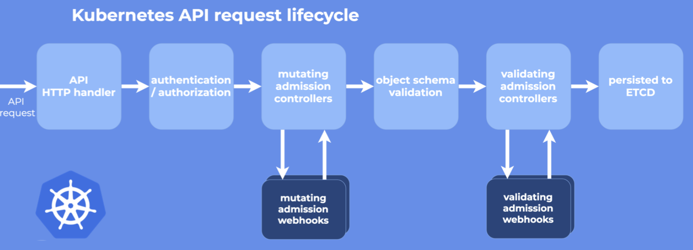

# kube-apiserver

## 简介

kube-apiserver：

- 将 k8s 的所有资源对象封装成 REST 风格的 API 接口进行管理。
- 将集群的所有数据和状态存户的 Etcd 中。
- 提供丰富的安全访问机制，包括认证、授权及准入控制（admission control）。
- 提供了集群各组件间的通讯和交互功能。

k8s 基于 go-restful 框架，因为其具有很好的可定制化性。

## 架构

k8s 内包含 3 个独立的 server，用于将功能进行解耦，分别是：

- kube-aggregator：以下 3 个 server 的 proxy。而代理 API 请求到 apiextension-server 的过程被称为 API aggregation。
- kube-apiserver：k8s 内置核心资源服务，并通过 legacyscheme.Scheme 注册管理资源。
- APIExtensionServer：提供了 CRD 的自定义资源服务，并通过 apiextensionserver.Scheme 注册管理 CRD 相关资源。
- AggregatorServer：对 k8s 进行扩展，并通过 aggregatorscheme.Scheme 注册管理相关资源。

其中 APIExtensionServer 和 AggregatorServer 都可以在不修改 k8s 核心代码的前提下扩展 k8s 的资源。但这 3 个 server 都是基于 GenericAPIServer 实现。

## 启动流程

- 注册资源：将所支持的 resource 注册到 scheme（三个 server 分别有各自的 scheme）中。它是通过 pkg 的 init() 来实现的，调用了 k8s 各个资源下的 install 包。
- Cobra 命令行参数解析：通过 NewServerRunOptions() 初始化 options 结构，通过 Complete() 填充默认参数，通过 Validate() 验证参数的合法性，最后通过 Run() 将参数传入组件启动逻辑。
- 创建 kube-apiserver 通用配置：
  - genericConfig：
  - OpenAPI 配置：
  - Etcd 配置：
  - Authentication 配置：有 9 种机制可选
  - Authorization 配置：有 6 种机制可选
  - Admission 配置：有 31 种机制可选
- 创建 APIExtensionServer：
  - 创建 GenericAPIServer：如下 3 个 server 都会创建，通过它将 k8s 的资源与 REST API 进行映射。它会先创建 go-rest web server，等待后续 InstallAPI 来具体设置 web 的路由。
  - 实例化 CRD
  - 实例化 APIGroupInfo：资源组信息
  - 注册 APIGroup 到 web server 中：将 APIGroup 的信息的 Path 和 Handler 方法注册到 web server 的路由中。
- 创建 KubeAPIServer：
  - 创建 GenericAPIServer：
  - 实例化 master：
  - 注册 /api 资源到 web server 中：这里是无 group 的 core/legacy 资源。
  - 注册 /apis 资源到 web server 中：这里是有 group 的普通资源。
- 创建 AggregatorServer：
  - 创建 GenericAPIServer：
  - 实例化 APIAggregator：
  - 实例化 APIGroupInfo：
  - 注册 APIGroup 到 web server 中：
- 启动服务：
  - 启动 HTTP 服务：
  - 启动 HTTPS 服务：

## 处理请求

### 整体

- 请求经过 Handler Chain：三个 server 共用 kube-apiserver 的 Hanlder Chain，包括 HTTP Handler 处理（日志审计、切换用户、限流）、Authentication 身份认证、Authorization 授权、Admission 准入（拦截 HTTP 请求，进行校验、修改或拒绝等操作）。
- 拦截/转发请求：由 kube-aggregator 进行拦截，如对 `/apis/aggregated-API-group-name` 路径下的请求进行拦截。并且由 kube-aggregator 将拦截的请求转发给相应的 server。

### HTTP Handler/Filter
- WithPanicRecovery()
- WithRequestInfo()
- WithWaitGroup()
- WithTimeoutNonLongRunningRequests()
- WithCORS()
- WithAuthentication()：启动 Authentication，调用下面的 Authenticator
- WithAudit()
- WithImpersonation()
- WithMaxInFlightLimit()
- WithAuthorization()：启动 Authorization

### Authentication
当请求发送至 kube-apiserver 时，该请求会进入 Authentication Handler 函数，该函数会遍历已启动的 Authenticator，当有一个 Authenticator 返回 true 时，则认证成功，否则继续尝试下一个 Authenticator。

- BasicAuth：把`UserName:Password`用BASE64编码后放入Authorization Header中发送给`kube-apiserver`
- ClientCA：
- TokenAuth：用token来表明user身份，`kube-apiserver`通过私钥来识别用户的合法性
- BootstrapToken：
- RequestHeader：
- WebhookTokenAuth：
- Anonymous：
- OIDC：
- ServiceAccountAuth：

### Authorization

如果开启多个 Authz 功能，则按照顺序执行 Authorizer，在前面的 Authorizer 具有更高的优先级来允许或拒绝请求。客户端发起一个请求，只要有一个 Authorizer 通过则授权成功。

kube-apiserver 收到一个 request 后，会根据其中数据创建 access policy object，然后将这个 object 与 access policy 逐条匹配，如果有至少一条匹配，则鉴权通过。

- AlwaysAllow：
- AlwaysDeny：
- ABAC：通过如subject user、group，resource/object apiGroup、namespace、resource等现有的attribute来鉴权。
- WebHook：k8s调用外部的access control service来进行用户授权。
- RBAC：
  - Role：一个NS中一组permission/rule的集合
  - ClusterRole：整个k8s集群的一组permission/rule的集合
  - RoleBinding：把一个role绑定到一个user/group/serviceAccount，roleBinding也可使用clusterRole，把一个clusterRole运用在一个NS内。
  - ClusterRoleBinding：把一个clusterRole绑定到一个user
- Node：

### Admission

当任何一个API对象被提交给 APIServer 之后，总有一些“初始化”性质的工作需要在它们被 k8s 正式处理之前进行。比如，自动为所有 Pod 加上某些标签（Label）。而这个“初始化”操作的实现，借助的是 Admission Control 功能。它其实是 k8s 里一组被称为 Admission Controller 的代码，可以选择性地被编译进 APIServer 中，在 API 对象创建之后会被立刻调用到。发送給 `kube-apiserver`的任何一个 request 都需要通过 admission controller 的检查，如果不通过则`kube-apiserver`拒绝此调用请求。

#### Web Hook

在 kube-apiserver 中包含两个特殊的准入控制器：Mutating 和 
Validating。这两个控制器将发送准入请求到外部的 HTTP 回调服务并接收一个准入响应。如果启用了这两个准入控制器，k8s 管理员可以在集群中创建和配置一个 admission webhook。

总的来说，步骤如下：

- 检查集群中是否启用了 admission webhook 控制器，并根据需要进行配置。
- 编写处理准入请求的 HTTP 回调服务：回调可以是一个部署在集群中的简单 HTTP 服务，甚至也可以是一个外部 HTTP 服务
- 通过 MutatingWebhookConfiguration 和 ValidatingWebhookConfiguration 资源配置 admission webhook。

这两种类型的 admission webhook 之间的区别是非常明显的：validating webhooks  可以拒绝请求，但是它们却不能修改在准入请求中获取的对象，而 mutating webhooks  可以在返回准入响应之前通过创建补丁来修改对象，如果 webhook 拒绝了一个请求，则会向最终用户返回错误。

#### Initializer

k8s 提供了一种“热插拔”式的 Admission 机制，它就是 Dynamic Admission Control，也叫作：Initializer。Initializer 也是一个controller，实时查看用户给 APIServer 的请求，遇到实际状态与期望值不同时，更新用户 API 对象。更新用户的 API 对象时，使用 PATCH API 来完成 merge 工作。而这种 PATCH API，正是声明式API最主要的能力。Initializer会 再创建一个新的对象，然后通过 TwoWayMergePatch 和 PATCH API 把两个 API 对象merge，完成类似注入的操作。

当任何一个 API 对象被提交给 kube-apiserver 之后，总有一些“初始化”性质的工作需要在它们被 k8s 正式处理之前进行。比如，自动为所有Pod加上某些标签（Labels）。而这个“初始化”操作的实现，借助的是 Admission Control 功能。它其实是 k8s 里一组被称为Admission Controller的代码，可以选择性地被编译进 Server 中，在 API 对象创建之后会被立刻调用到。k8s 提供了一种“热插拔”式的 Admission 机制，它就是 Dynamic Admission Control，也叫作：Initializer。

Initializer 也是一个 controller，实时查看用户给 APIServe的请求，遇到实际状态与期望值不同时，更新用户API对象。更新用户的API对象的时候，使用PATCH API来完成merge工作。而这种PATCH API，正是声明式API最主要的能力。Initializer会再创建一个新的对象，然后通过TwoWayMergePatch和PATCH API把两个API对象merge，完成类似注入的操作。

发送个`kube-apiserver`的任何一个 request 都需要通过买个admission controller的检查，如果不通过则`kube-apiserver`拒绝此调用请求。

##### 类型

- 变更 Mutating Admission Controller：用于变更信息，能够修改用户提交的资料信息。
- 验证 Validating Admission Controller：用于身份验证，能够验证用户提交的资料对象信息。

#### vs. Webhook

admission controller是一组标准的控制器，拦截API请求，进行请求验证/修改。admission webhook就是由这些控制器调用的，运行在k8s外部的http服务，用来实现修改、验证等逻辑。因为这部分check牵涉到“业务逻辑”，不适合编写在k8s里面，所以采用动态扩展、可拔插的模式。

## K8s Proxy API

一般情况下，kube-apiserver 把收到的 REST request 转发到某个 node 的 kubelet 的 REST 端口上。当使用 k8s proxy API 时，获得的数据直接来自 node 而非 Etcd，因此它绕过了以下步骤：

- Authentication：

  - 最严格的HTTPS证书认证，基于CA根证书签名的双向数字证书 认证方式
  - HTTP Token认证：通过一个Token来识别合法用户
  - Http Base认证：通过用户名+密码的方式认证
- Authorization：API Server授权，包括AlwayDeny、AlwaAllow、ABAC、RBAC、WebHook
- Admission Control：k8s AC体系中的最后一道关卡，官方标准的Adminssion Control就有10个，在启动kube-apiserver时指定

### 操作

- `kubectl proxy --port=8080`: create a local proxy for the local `kubelet` `API server`
- `curl 127.0.0.1:8080/api`
- `curl 127.0.0.1:8080/api/v1`
- `curl 127.0.0.1:8080/api/v1/pods`

## Ref

1. [深入理解 Kubernetes Admission Webhook](https://www.toutiao.com/article/6712393368413929995)
