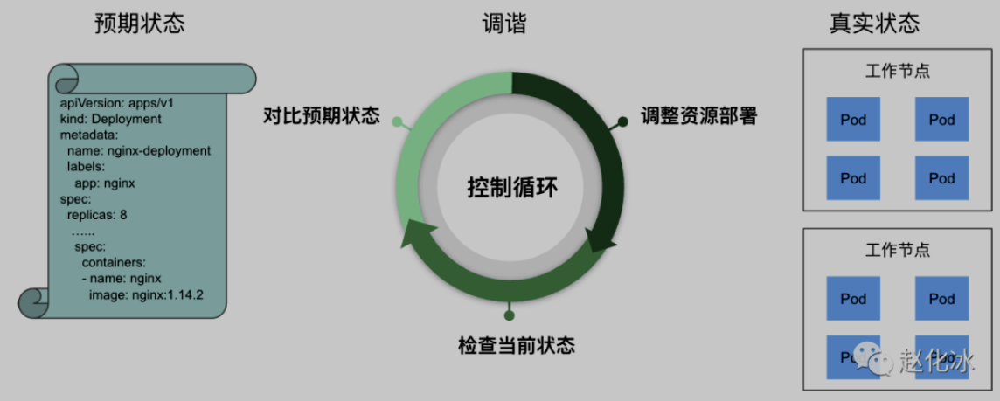
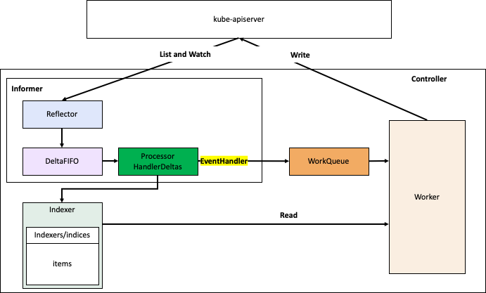
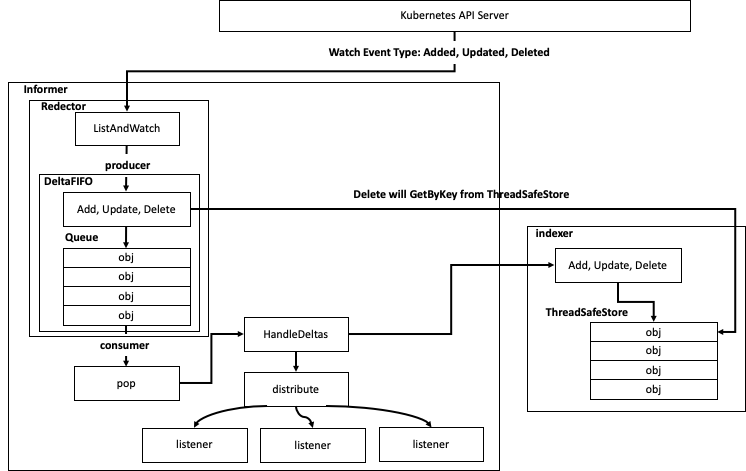
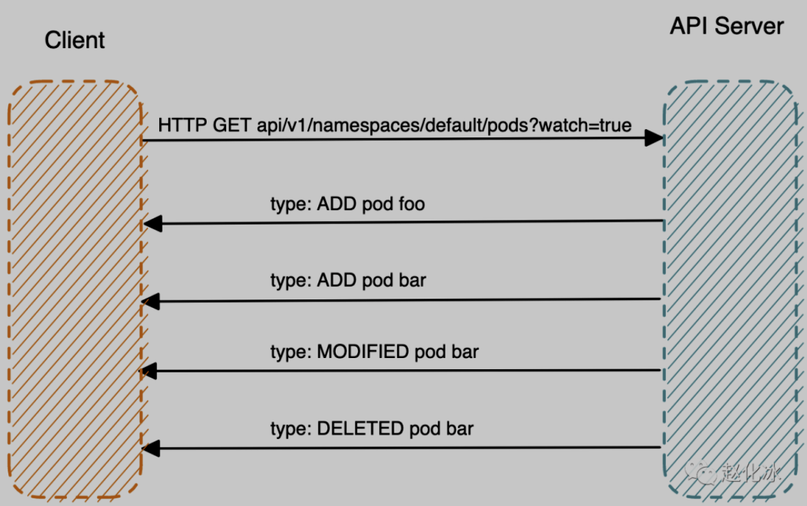
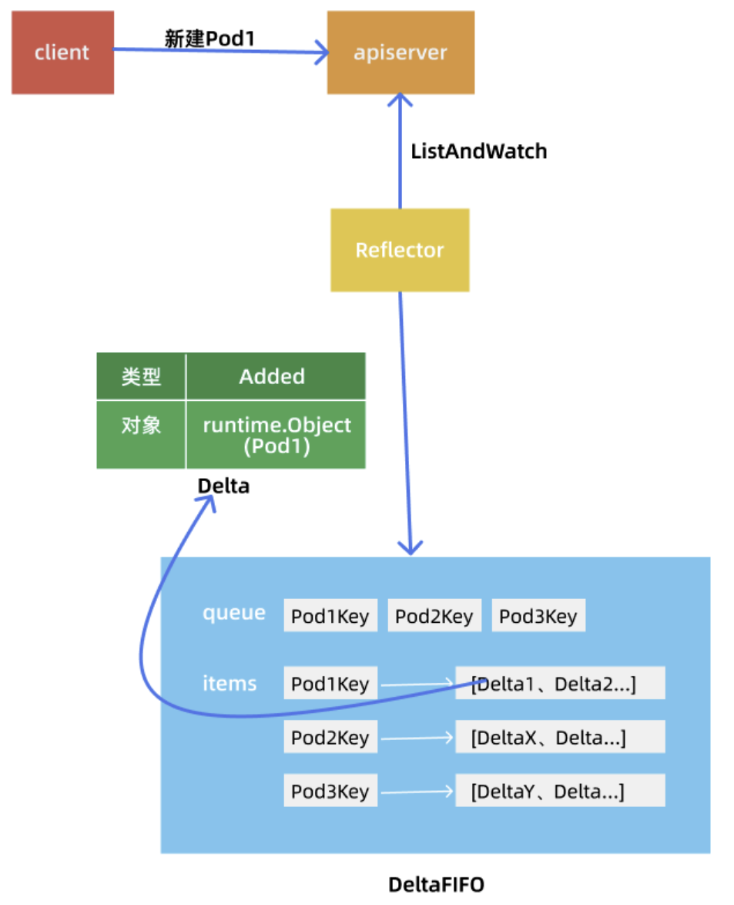
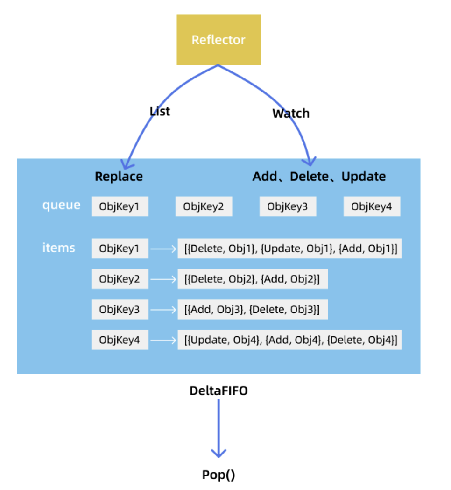
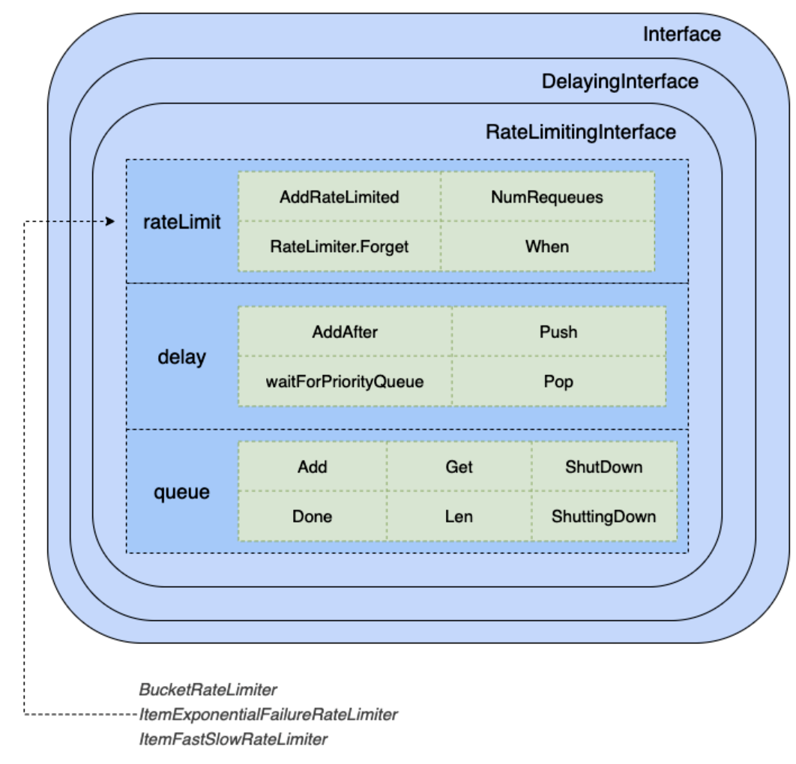
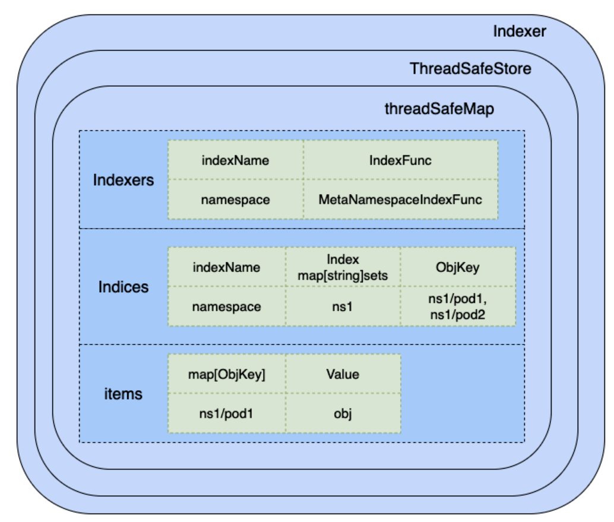

# Controller

## 简介

在 k8s 中，controller 用来实现真正的 k8s 业务逻辑，它可以根据期望状态和实际状态来进行调谐，以确保应用始终处于所需的状态。controller 可以对 k8s 的核心资源（如 pod、deployment）等进场操作，但也可以观察并操作用户自定义资源。controller 实现了一个控制循环，它通过 kube-apiserver 观测集群中的共享状态，进行必要的变更从而把资源对应的当前状态（status）向期望的目标状态（spec）转变。controller 负责执行例行性任务来保证集群尽可能接近其期望状态，典型情况下控制器读取 `.spec` 字段、执行一些逻辑、然后修改 `.status` 字段。k8s 自身提供了大量的 controller，并由 controller manager 统一管理。

例如下图中，用户定义了一个 Deployment 资源，其中指定了运行的容器镜像，副本数等信息。Deployment Controller  会根据该定义在 K8s 节点上创建对应的 Pod，并对这些 Pod 进行持续监控。如果某个 Pod 异常退出了，Deployment  Controller 会重新创建一个 Pod，以保证系统的实际状态和用户定义的“预期状态”（8个副本）一致。



### 原理

- 事件驱动：动作（create/update/delete）+资源的key（以namespace/name的形式表示）
- 申明式（通过 Reconcile Loop）：使 object 的 status 与 object 的 Spec 中定义的状态保持一致。其具体控制逻辑为：
  - 监控：1/ 监视 object 的当前 status 实际状态变化；2/ 接收 object 的新的创建/更新/删除事件。
  - 触发：对比 object 的当前 status 与期望 spec，判断是否触发后续的执行操作。因此只需要注入 EventHandler 将变化的事件放入 WorkQueue。
  - 执行：worker 执行能够调整 object 当前状态变化的操作，使之与期望状态匹配。
  - 更新：调用完成后，worker 会将 object 的状态更新为当前实际状态。
- aspect-oriented：用于解决业务的高复杂性，提升架构的可扩展性

### 架构

一般而言，controller 包含：
- Client：用于调用远程的 kube-apiserver。
- Informer（多个）：每个 Informer 监控一种资源，它从 DeltaFIFO 取出 API 对象，根据事件的类型来创建、更新或删除本地缓存。Informer 另一方面可以调用注册的 Event Handler 把 API 对象发送给对应的 controller。
  - Reflector：维护与 APIServer 的连接，使用 ListAndWatcher 方法来监听对象的变化，并把该变化事件及对应的 API 对象存入 DeltaFIFO 队列中。为了获得当前状态的详细信息，Reflector 会向 kube-apiserver 发送请求，并负责 watch 资源对象的状态变化，将相关 Event 发送到 WorkQueue 中。
  - DeltaFIFO：
  - HandlerDelta（EventHandler）：处理相关资源发生变化的 Event，将一个 API 对象的 key 存入 workQueue 中，这里存储的只是 API 对象的 key，value 会基于 key 去 Indexer 缓存中拉取。
- WorkQueue：存储事件的消息队列，用于异步接受 event。
- Indexer：用于本地缓存 Etcd 中资源的信息。它使用线程安全的数据存储来缓存 API 对象及其值，为 controller 提供数据索引功能。
- Worker：真正的业务处理逻辑，从 WorkQueue 中取出事件进行处理。它是个 Loop，会循环获取到 API 对象后则会根据 API 对象描述的期望状态与集群中的实际状态进行比对、协调，最终达到期望状态。



## Client

通常不会直接向 kube-apiserver 发请求，而是通过 client-go 提供的编程接口。k8s 的主要 Go 编程接口依赖 `k8s.io/client-go` 这个库。它是一个典型的 web 客户端库，可以用于调用对应的 k8s 集群对应的 API，实现常用的 REST 动作。client-go 负责与 kube-apiserver 通信，获取 API resource 的状态信息。同时，client-go 提供了缓存功能，避免反复从 kube-apiserver 获取数据。client-go 支持 4 种客户端与 kube-apiserver 交互。


### kubeconfig

kubeconfig 用于管理访问 kube-apiserver 的配置信息，默认情况下放置在 `$HOME/.kube/config` 路径下，主要包括

- cluster：k8s 集群信息，如 kube-apiserver 地址、集群证书等。
- users：用户身份演进的凭据，如 client-certificate、client-key、token 及 username/password。
- contexts：集群用户信息及 namespace，用于将请求发送到指定的集群。

### RESTClient

RESTClient 是最基础的客户端，它对 HTTP Request 进行了封装，实现了 RESTful 风格的 API，后续的 ClientSet、DynamicClient、DiscoveryClient 都是基于 RESTClient 实现的。

但 RESTClient 是最基本的，只能操作一种资源。

### ClientSet

ClientSet 在 RESTClient 的基础上封装了对 Resource 和 Version 的管理方法（不需要再在 RESTClient 中配置 API、Group、Version 等与 resource 相关的信息）。每个 resource 可以理解为一个客户端，而 ClientSet 则是多个客户端的集合，可以让用户同时访问多个 resource。一般情况下，对 k8s 的二次开发使用 ClientSet，但 ClientSet 只能处理 k8s 的内置资源。

### DynamicClient

DynamicClient 与 ClientSet 最大的区别在于它能够处理 k8s 中的所有 resource，包括 CRD。DynamicClient 的处理过程将 Resource 转换成 unstructure 结构，再进行处理。处理完后，再将 unstructure 转换成 k8s 的结构体，整个过程类似于 Go 的 interface{} 断言转换过程。

DynamicClient 的输入和输出都是 `*unstructred.Unstructured` 对象，它的数据结构与 json.Unmarshall 的反序列化后的输出一样。

### DiscoveryClient

DiscoveryClient 用于发现 kube-apiserver 所支持的 group、version 和 resource。`kubectl api-versions` 与 `kubectl api-resources` 命令通过 DiscoveryClient 实现，但它也是基于 RESTClient 的基础上封装的。

## Informer

采用 k8s HTTP API 可以查询 K8s API 资源对象并 Watch 其变化，但大量的 HTTP 调用会对 API Server  造成较大的负荷，而且网络调用可能存在较大的延迟。除此之外，开发者还需要在程序中处理资源的缓存，HTTP  链接出问题后的重连等。为了解决这些问题并简化 Controller 的开发工作，K8s 在 client go 中提供了一个 informer  客户端库。

Informer 是基于 client-go 实现的 k8s 客户端程序框架，它用于观察 kube-apiserver 中的某一种特定的资源，并在发现该资源发生变化时触发对应动作，它是对如 watch 等机制的可靠封装。Informer 提供了一种方法，让客户端应用程序可以高效地监视资源的更改，而无需不断地向 API 服务器发出请求。

相比直接采用 HTTP Watch，使用 k8s Informer 有以下优势：

- 减少 API 服务器的负载：通过在本地缓存资源信息，Informer 减少了需要向 API 服务器发出的请求数量。这可以防止由于 API 服务器过载而影响整个集群的性能。
- 提高应用程序性能：使用缓存的数据，客户端应用程序可以快速访问资源信息，而无需等待 API 服务器响应。这可以提高应用程序性能并减少延迟。
- 简化代码：Informer 提供了一种更简单、更流畅的方式来监视 k8s 中的资源更改。客户端应用程序可以使用现有的 Informer 库来处理这些任务，而无需编写复杂的代码来管理与 API 服务器的连接并处理更新。
- 更高的可靠性：由于 Informer 在本地缓存数据，因此即使 API 服务器不可用或存在问题，它们也可以继续工作。这可以确保客户端应用程序即使在底层 k8s 基础结构出现问题时也能保持功能。

### 架构

下图中分为 2 部分，分别是 Informer 库中的组件，和使用 Informer 库编写的自定义 Controller 的组件，这 2 部分一起组成了一个完整的 Controller。


采用 Informer 机制编写的 Controller 中的主要流程如下：

1. Reflector 采用 K8s HTTP API List/Watch API Server 中指定的资源。Reflector 会先 List 资源，然后使用 List 接口返回的 resourceVersion 来 watch 后续的资源变化。对应的源码：Reflector ListAndWatch。

2. Reflector 将 List 得到的资源列表和后续的资源变化放到一个 FIFO（先进先出）队列中。对应的源码：使用 List 的结果刷新 FIFO 队列和将 Watch 收到的事件加入到 FIFO 队列。

3. Informer 在 HanlderDelta 循环中从 FIFO 队列中拿出资源对象进行处理。对应源码：processLoop。

4. Informer 将从 FIFO 队列中拿出的资源对象放到 Indexer 中。对应的源码：processDeltas。Indexer 是 Informer 中的一个本地缓存，该缓存提供了索引功能（这是该组件取名为 Indexer  的原因），允许基于特定条件（如标签、注释或字段选择器）快速有效地查找资源。此处代码中的 clientState 就是 Indexer，来自于 NewIndexerInformer 方法中构建的 Indexer，该 Indexer 作为 clientState  参数传递给了 newInformer 方法。

5. Indexer 将收到的资源对象放入其内部的缓存 ThreadSafeStore 中。

6. 回调 Controller 的 ResourceEventHandler，将资源对象变化通知到应用逻辑。对应的源码：processDeltas。

7. 在 ResourceEventHandler 对资源对象的变化进行处理。ResourceEventHandler 处于用户的 Controller 代码中，k8s 推荐的编程范式是将收到的消息放入到一个队列中，然后在一个循环中处理该队列中的消息，执行调谐逻辑。推荐该模式的原因是采用队列可以解耦消息生产者（Informer）和消费者（Controller 调谐逻辑），避免消费者阻塞生产者。在用户代码中需要注意几点：

Reflector 会使用 List 的结果刷新 FIFO 队列，因此 ResourceEventHandler 收到的资源变化消息其实包含了 Informer  启动时获取的完整资源列表，Informer 会采用 ADDED 事件将列表的资源通知到用户 Controller。该机制屏蔽了 List 和  Watch 的细节，保证用户的 ResourceEventHandler 代码中会接收到 Controller 监控的资源的完整数据，包括启动 Controller 前已有的资源数据，以及之后的资源变化。



### SharedIndexInformer

如果在一个应用中有多处相互独立的业务逻辑都需要监控同一种资源对象，用户会编写多个 Informer 来进行处理。这会导致应用中发起对 K8s API Server 同一资源的多次 ListAndWatch 调用，并且每一个  Informer 中都有一份单独的本地缓存，增加了内存占用。

因此一个良好的设计思路为，同一类资源 Informer 共享一个 Reflector，这就是 K8s 中 SharedInformer 的机制。K8s 在 client go 中基于 Informer 之上再做了一层封装，提供了 SharedInformer 机制。采用  SharedInformer 后，客户端对同一种资源对象只会有一个对 API Server 的 ListAndWatch 调用，多个  Informer 也会共用同一份缓存，减少了对 API Server 的请求，提高了性能。

在具体实现中，SharedInformer 中有个 Informer map 数据结构，用于存放每个资源对应的 Informer。当应用代码调用 InformerFactory 获取某一资源类型的 Informer 时， SharedInformer 会判断该类型的  Informer 是否存在，如果不存在就新建一个 Informer 并保存到该 Map 中，如果已存在则直接返回该 Informer。因此应用中所有从 InformerFactory  中取出的同一类型的 Informer 都是同一个实例。

启动流程：
- NewForConfig(config)：创建 clientset
  
- NewSharedInformerFactory()：创建共享 informer 的 factory
  
- informerFactory.Core().V1().Pods()：创建某个资源的 informer
  
- podInformer.Informer().AddEventHandler()：添加 handler
  
- informerFactory.Start()：启动 factory
  
- informerFactory.WaitForCacheSync()：等待缓存填充完毕
  

### Reflector

Reflector 基于 client-go 实现监控（ListAndWatch）对应的资源，其中包含 ListerWatcher、store(DeltaFIFO)、lastSyncResourceVersion、resyncPeriod 等信息。当资源发生变化时，会触发相应 resource object 的变更事件，并将该 resource object 及对其的操作类型（统称为 Delta）放入本地缓存 DeltaFIFO 中。

这是远端（kube-apiserver）和本地（DeltaFIFO、Indexer、Listener）之间数据同步逻辑的核心，是通过 ListAndWatch 方法来实现。Reflector 首先通过 List 操作获取所有的资源对象数据，保存到本地存储，然后通过 Watch 操作监控资源的变化，触发相应的事件处理，比如前面示例中的 Add 事件、Update 事件、Delete 事件。

#### List&Watch

Reflector 主要就是 ListAndWatch() 函数，负责获取资源列表（list）和监控（watch）指定的 k8s 资源。

k8s 由 Etcd 存储集群的数据信息，而 kube-apiserver 作为统一入口，任何对数据的操作都必须经过 kube-apiserver。客户端（如 kubelet、scheduler、controller-manager）通过 list-watch 监听 kube-apiserver 中资源（如 pod、rs、rc 等）的 create、update 和 delete 等事件，并针对事件类型调用相应的 handler 事件处理函数。

list-watch 有 list 和 watch 两部分组成：list 就是调用资源的 list API 罗列所有资源，它基于 HTTP 短链接实现；而 watch 则是调用资源的 watch  API 监听资源变更事件，基于 HTTP 长链接实现。以 pod 资源为例，它的 list 和 watch API 分别为：

- List API：返回值为 PodList，即一组 pod

```http
HTTP GET api/v1/namespaces/default/pods
```

- Watch API：往往带上 `?watch=true`，表示采用 HTTP 长连接对 default namespace 下的 pod 进行持续监听。每当有新事件，返回一个 WatchEvent 。

```http
HTTP GET api/v1/namespaces/default/pods?watch=true
```



K8s 的 informer 模块封装了 list-watch API，用户只需要指定资源，编写事件处理函数 AddFunc、UpdateFunc 和 DeleteFunc 等。Informer 首先通过 list API 罗列资源，然后调用 watch  API 监听资源的变更事件，并将结果放入到一个 FIFO 队列。队列的另一头有 HandlerDelta 从中取出事件，并调用对应的注册 Handler 函数处理事件。Informer 还维护了一个只读的 Map Store 缓存，主要为了提升查询的效率，降低 kube-apiserver 的负载。

##### Watch实现

Watch 的 Event 在 APIServer 与 controller 之间通过 HTTP 流的方式传送，监听资源对象的 Event 变化（包括 Added、Modified、Deleted、Bookmark），并进行相应处理。Watch 是如何通过 HTTP 长链接接收 kube-apiserver 发来的资源变更事件呢？秘诀就是 Chunked Transfer Encoding（分块传输编码），它首次出现在HTTP/1.1 。

当客户端调用 watch API 时，kube-apiserver 在 response 的 HTTP  Header 中设置 Transfer-Encoding 的值为 chunked，表示采用分块传输编码。客户端收到该信息后，便和服务端建立连接，并等待下一个数据块，即资源的事件信息。例如：

```shell
$ curl -i http://{kube-api-server-ip}:8080/api/v1/watch/pods?watch=yes

HTTP/1.1 200 OK
Content-Type: application/json
Transfer-Encoding: chunked
Date: Thu, 02 Jan 2019 20:22:59 GMT
Transfer-Encoding: chunked

{"type":"ADDED", "object":{"kind":"Pod","apiVersion":"v1",...}}
{"type":"ADDED", "object":{"kind":"Pod","apiVersion":"v1",...}}
{"type":"MODIFIED", "object":{"kind":"Pod","apiVersion":"v1",...}}
...
```

List-Watch 基于 HTTP 协议，是 K8s 重要的异步消息通知机制。它通过 list 获取全量数据，通过 watch  API 监听增量数据，保证消息可靠性、实时性、性能和顺序性。而消息的实时性、可靠性和顺序性又是实现声明式设计的良好前提。

当 Reflector 监听到 Added、Updated、Deleted 事件时，将会自动将对应的 resource object 更新到本地缓存 DeltaFIFO 中。

### DeltaFIFO

Reflector 中通过 ListAndWatch 获取到数据后传入到了本地的存储中，也就是 DeltaFIFO 中。从 DeltaFIFO 的名字可以看出它是一个 FIFO，也就是一个先进先出的队列，而 Delta 表示的是变化的资源对象存储，包含操作资源对象的类型和数据，Reflector 就是这个队列的生产者。

#### Delta

Delta 其实就是 k8s 系统中带有变化类型的资源对象。比如添加了一个 Pod，那么这个 Delta 就是带有 Added 这个类型的 Pod，如果是删除了一个 Deployment，那么这个 Delta 就是带有 Deleted 类型的 Deployment，为什么要带上类型呢？因为需要根据不同的类型去执行不同的操作，增加、更新、删除的动作显然是不一样的。



#### DeltaFIFO

FIFO 就是一个先进先出的队列，Reflector 是其生产者。DeltaFIFO 是用于存储 Reflector 获得的待处理的 resource object event 及其操作类型的本地缓存。简单来说，它是一个生产者消费者队列，拥有 FIFO 的特性，操作的资源对象为 Delta，而每一个 Delta 是一个 resource object 以及对其的操作类型（如 Added、Updated、Deleted）。DeltaFIFO 的生产者是 Reflector 调用的 DeltaFIFO 的 Add 方法，而它的消费者是 HandlerDelta 调用的 DeltaFIFO 的 Pop 方法。

DeltaFIFO 由一个 FIFO（queue）和 Delta 的 Map（items）组成，其中 map 会保存对 resource object 的操作类型。ResourceEventHandler 中收到的消息中只有资源对象的 key，用户在 Controller 中可以使用该 key 为关键字，通过 Indexer 查询本地缓存中的完整资源对象。ObjKey 是基于 resource object，通过 DeltaFIFO.KeyOf() 函数计算资源对象的 UUID。


存储类型：

- interface：tools/cache/store.go，其实 store 就是个 map
- cache：default的实现
- UndeltaStore：实现 Store 接口，但数据存放在 cache 中，数据变更时通过 PushFunc 发送所有状态。
- FIFO：实现 Queue 接口（包含 Store 接口）
- DeltaFIFO：对象与上次处理时发生了哪些变化，Delta 的类型包括 Added、Updated、Deleted、Replaced。

DeltaFIFO 生产的数据来自 List、Watch、Resync 等 Event，而消费的数据会发送到 WorkQueue 并缓存到 Indexer。

具体操作时，Reflector 通过 ListAndWatch 首先获取全量的资源对象数据，然后调用 DeltaFIFO 的 Replace()  方法全量插入队列，然后后续通过 Watch 操作根据资源对象的操作类型调用 DeltaFIFO 的 Add、Update、Delete  方法，将数据更新到队列中。可以用下图来总结这两个组件之间的关系：



### HandlerDelta

HandlerDelta 是一个针对不同 resource 的 handler 回调函数的路由分发器。它消费 DeltaFIFO 中排队的 Delta，并通过 distribute() 函数将 Delta 分发至不同的 handler（回调函数）。通过 Informer 的`AddEventHandler()` 可以向 HandlerDelta 注册新的 handler 回调函数。 当 HandleDeltas 处理 DeltaFIFO 中的 Delta 时，会将这些更新事件派发给注册的 Handler。

Informer 可以非常方便的动态获取各种资源的实时变化，开发者只需要在对应的 Informer 的 HandlerDelta 中调用 `AddEventHandler` 添加相应的逻辑处理 `AddFunc`、 `DeleteFunc`、 `UpdateFun`，就可以处理该 resource 的`Added`、`Deleted`、`Updated`动态变化。这样，整个开发流程就变得非常简单，开发者只需要注重回调的逻辑处理，而不用关心具体事件的生成和派发。在大部分场景中，Handler 的操作逻辑包括：

- 更新本地缓存 Indexer：
- 将 resource object 推送到 WorkQueue：从而等待对应的 worker 来做下一步处理。

因此，对 Delta 真正的操作不在 HandlerDelta 中，它只是对 DeltaFIFO 的消费处理。真正的操作会由 Controller 中的 Worker 来实施。

## WorkQueue

HandlerDelta 中注册的 Handler 通过回调函数接收到对应的 event 之后，需要将对应的 ObjKey 放入 WorkQueue 中，从而方便并行的多个 worker 去消费，它用于保证：1/ Worker 处理速度低于 Event 产生速度；2/ 在必要时可以重试。

使用 WorkQueue 的优势包括：

- 并发：支持多生产者、多消费者
- 去重：由 dirty 保证一段时间内的一个元素只会被处理一次
- 有序：保证处理顺序，由 queue 来提供
- 标记：标示以恶搞元素是否正在被处理，由 processing来 提供
- 延迟：支持延迟队列，延迟将元素放入队列
- 限速：支持限速队列，对放入的元素进行速率限制
- 通知：ShutDown 告知该 workqueue 不再接收新的元素

WorkQueue 内部主要有 3个结构：

- queue：实际存储 item 的地方，为 slice 类型保证了有序性。
- dirty：确保去重，哪怕一个 item 被添加了多次，也只会被处理一次。
- processing：用于记录 item 是否正在被处理。

### 延迟队列

基于 WorkQueue 增加了 AddAfter() 方法，用于延迟一段时间后再将 item 插入 WorkQueue 队列中。AddAfter() 会插入一个 item，并附上一个 duration 延时。该 duration 会指定一个延时时间，如果 duration 小于等于 0，则直接会将 item 加入队列中。

### 限速队列

限速队列利用延迟队列的特性，延迟某个 item 的插入时间，从而达到限速的目的。它提供 4 种限速接口算法 RateLimiter：

- 令牌桶算法：是一个固定速率（qps）的限速器，该限速器是利用 `golang.org/x/time/rate` 库来实现。令牌桶算法内部实现了一个存放 token 的“桶”。初始时“桶”是空的，token 会以固定速率往“桶”里填充，直到将其填满为止，多余的 token 会被丢弃。每个 item 都会从令牌桶得到一个 token，只有得到 token 的 item 才允许通过，而没有得到 token 的 item 处于等待状态。令牌桶算法通过控制发放 token 来达到限速目的。
- 排队指数算法：
- 计数器算法：
- 混合模式：



## Indexer

Indexer 可以理解为 Etcd 在 Informer 的本地全量缓存，它是 Controller 用来存储 resource object 并自带 index 的本地存储，提供数据存储和数据索引功能。Controller 如果每次获取几个 object 就去访问 kube-apisever，会给 kube-apiserver 带来较大的压力。DeltaFIFO 通过 HandlerDelta 消费出来的 resource object 会存储在 Indexer。 Indexer 与 Etcd 中的数据保持完全一致，这样 Controller 可以很方便的从 Indexer 中读取相应 resource object 数据，而无需从远程的 Etcd 中读取，以减轻 kube-apiserver 的压力。

其通过 DeltaFIFO 中最新的 Delta 不停的更新自身信息，同时需要在本地（DeltaFIFO、Indexer、Listener）之间执行同步，以上两个更新和同步的步骤都由 Reflector 的 ListAndWatch 来触发。同时在本地 crash，需要进行 replace 时，也需要查看到 Indexer 中当前存储的所有 key。

### ThreadSafeMap

ThreadSafeMap 是一个在内存中实现并发安全的 map，在每次增、删、改、查操作时都会加锁，以保证数据的一致性。Informer 的 Indexer 就是在它之上做了封装，在每次增删改查 ThreadSafeMap 数据时，都会自动更新索引。

### Index 索引

Indexer 除了维护了一份本地内存缓存外，还有一个很重要的功能，便是索引功能了。索引的目的就是为了快速查找，比如需要查找某个 node 节点上的所有 pod、查找某个 namespace 下的所有 pod 等。利用到索引，可以实现快速查找。关于索引功能，则依赖于 threadSafeMap 结构体中的 indexers 与 indices 属性。

- Indexers：包含了所有索引器及其 IndexFunc，IndexFunc 为计算某个索引键下的所有对象键列表的方法。

```go
Indexers: {
  "namespace": MetaNamespaceIndexFunc,
  "nodeName": NodeNameIndexFunc,
}

func NodeNameIndexFunc(obj interface{})([]string, error){
  pod, ok := obj.(*v1.Pod)
  ...
  return []string{pod.Spec.NodeName}, nil
}
```

- Indices：包含了所有索引器及其所有的索引数据。

```go
Indices:{
  "namespace":{
    "default": ["pod1", "pod2"],
    "kube-system": ["pod3"],
  }
  "nodeName":{
    "node1": ["pod1"],
    "node2": ["pod2", "pod3"],
  }
}
```

- Index：包含了索引键以及索引键下的所有对象键的列表。



## Worker

Controller 中以 goroutine 协程方式启动 Run 方法，会启动 Reflector 的 ListAndWatch()，用于从 apiserver 拉取全量和监听增量资源，存储到 DeltaFIFO。接着，启动 processLoop 不断从 DeltaFIFO Pop 进行消费。在 sharedIndexInformer 中 Pop 出来进行处理的函数是 HandleDeltas，一方面维护 Indexer 的 Add/Update/Delete，另一方面调用下游 sharedProcessor 进行 handler 处理。

controller 的 Run() 函数通过 runWorker() 函数持续不断地执行 processWorkItem() 函数，最终的业务逻辑会在 syncHandler() 函数中实现。

### Reconciler 控制循环

在 K8s 中，用户通过**声明式 API** 定义资源的“预期状态”，Controller 则负责监视资源的实际状态，当资源的实际状态和“预期状态”不一致时，Controller 则对系统进行必要的更改，以确保两者一致，这个过程被称之为 Reconcile（调谐）。

- 读取资源的状态：通常采用事件驱动模式
- 改变资源的状态：
- 通过 kube-apiserver 更新资源的状态：
- 循环执行以上3步：

### 自定义代码

总体来说，需要自定义的代码只有：

1. 添加 HandlerDelta 的回调函数：调用`AddEventHandler`，添加相应的逻辑处理`AddFunc`、`DeleteFunc`、`UpdateFun`。其本质是实现观察，将变化的事件放入 WorkQueue 中。
2. 实现 Worker 逻辑：从 WorkQueue 中消费 ObjKey 即可。其本质是分析、执行、更新。

## Lab

### Client

- 启动一个 pod：`kubectl run test --image=nginx --image-pull-policy=IfNotPresent`

- [restClient](02_restclient.go)：首先通过 kubeconfig 配置信息实例化 RESTClient 对象，并通过各种方法不全参数。通过 Do() 函数执行请求，Into() 函数将请求结果解析到对应类型中。
- [clientSet](05_clientset.go): get the test pod info
- [clientSet](07_clientset.go): get the running pod number in all the namespaces
- [clientSet](09_clientset.go): get various info about pods and nodes
- [dynamicClient](11_dynamicclient.go)：
- [discoveryClient](13_discoveryclient.go)：

### Informer

#### List&Watch

- `kubectl proxy` 启动 API Server 的代理服务器

```shell
kubectl proxy --port 8080
```
  - 通过 `curl` 来 List pod 资源。

```shell
curl http://localhost:8080/api/v1/namespaces/default/pods
```

  - 在请求中加上 watch 参数，并带上前面 List 返回的版本号，以 watch pod 资源的变化。

```shell
curl http://localhost:8080/api/v1/namespaces/default/pods?watch=true&resourceVersion=770715
```

- 在另一个终端中创建一个名为 test 的 pod，然后将其删除，可以看到下面的输出：从上面 HTTP Watch 返回的 Response 中，可以看到有三种类型的事件：ADDED，MODIFIED 和  DELETED。ADDED 表示创建了新的 Pod，Pod 的状态变化会产生 MODIFIED 类型的事件，DELETED 则表示 Pod  被删除。

#### Informer

[Informer](21_informer.go)：首先建立 clientSet 与 kube-apiserver 进行交互。实例化 SharedInformer 对象，并通过此获得 Pod 资源的 Informer 对象。为 Pod Informer 添加 Pod 资源的回调方法 AddFunc、UpdateFunc、DeleteFunc。在正常情况下，回调方法会将 resource object 推送到 WorkQueue 中，但在本示例中，为了简便直接打印。为了测试 Event Handler，可删除一个 pod，如 `kubectl delete pod test`。

#### Informer with WorkQueue

[Informer with WorkQueue](26_informer-workqueue.go)：把 Event 中获得的 Obj 添加到 WorkQueue 中。

### Controller

- [Ingress Manager Controller](80_ingress-mgr/README.md)

## Ref

- [图解 K8S 源码 - Deployment Controller 篇](https://developer.aliyun.com/article/774817)
- [Kubernetes Controller 机制详解](https://mp.weixin.qq.com/s/TyA1bNXLQs1mXzZbw2PHfw)
