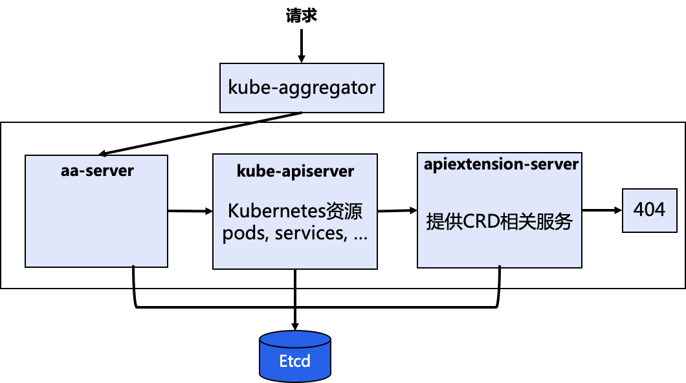
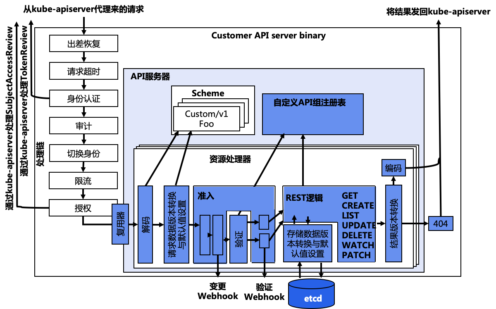

# aa-server

## 简介

aa-server（aggregated-apiserver）的设计思路是允许用户编写一个自定义的 APIServer，在这里面添加自定义 API。这个 APIServer 就可以跟 k8s 原生的 kube-apiserver 绑定部署在一起统一提供服务了。同时，构建出的 API 接口更加规范整齐，能利用 k8s 原生的认证、授权、准入机制。

不同于 CRD，aa-server 中的 API 资源是通过代码向 k8s 注册资源类型的方式实现的，而 CRD 是直接通过 yaml 文件创建自定义资源的方式实现的。因此 aa-server 有着更大的自由度，没有太多限制。



### 使用场景

- 非 Etcd 存储
- 支持 protobuf，而非只有 JSON
- 需要扩展 /status 和 /scale 子资源，如 /logs、/port-forward 等
- 可以用 Go 高效实现所有操作，包括验证、准入和转换，尤其是支持大规模场景

## 架构

### 整体架构

aa-server 与 kube-apiserver 都是基于 `k8s.io/apiserver` 这个库来实现的。但最大的区别在于 aa-server 会在一个 k8s 集群内运行，有一个可用的 kube-apiserver 来代理或获取其他 k8s 资源。kube-aggregator 在 kube-apiserver 中用于用于代理、转发 aa-server 请求。它知道 自定义的 aa-server 以及它提供的 API 资源，以便正确地转发请求到对应的 aa-server 上。其处理流程包括：

- kube-apiserver 收到请求
- kube-apiserver 的 handling filter 进行处理，包括身份认证、日志审计、用户切换、限流和授权
- kube-aggregator 代理、转发 aa-server 提供的 API 服务给 aa-server


### 内部架构

aa-server 有着：

- 与 kube-apiserver 有着相同的结构
- 拥有自己的处理链：包括身份认证、日志审计、用户切换、限流和授权，但有些操作会委托给 kube-apiserver 来处理
- 拥有自己的 resource 处理链：包括解码、转换、准入、REST mapping 和编码
- 调用准入 webhook：
- 数据写入 Etcd：
- 拥有自己的 scheme 注册表：
- 委托 AuthN：通过 TokenAccessReview 委托 kube-apiserver 进行身份认证
- 审计：自己进行 audit
- 委托 AuthZ：通过 SubjectAccessReivew 委托 kube-apiserver 进行授权



#### Auth

由于 aa-server 位于 kube-apiserver（kube-aggregator）之后，所以请求到达时已经被 kube-apiserver 认证过了。kube-apiserver 会将认证的结果放在 HTTP header 里，通常是 X-Remote-User 和 X-Remote-Group 中。aa-server 通过客户端 CA 对这些 header 进行认证。

#### Authz

aa-server 通过 SubjectAccessReview 代理给 kube-apiserver。而 kube-apiserver 收到请求后，会基于集群的 RBAC 规则做出判断，返回一个 SubjectAccessReview 对象。

## Lab

### sample-apisrver

K8s 提供的 [kubernetes/sample-apiserver](https://github.com/kubernetes/sample-apiserver)，但是这个例子依赖于主 kube-apiserver。即使不使用 authn/authz 或 API聚合，也是如此。需要通过 --kubeconfig 来指向一个主 kube-apiserver，样例中的 SharedInformer 依赖于会连接到主 kube-apiserver 来访问 k8s 资源。

#### 准备 kube-apiserver

准备一个 k8s 集群，提供主 kube-apiserver

```shell
go install sigs.k8s.io/kind@v0.14.0 && kind create cluster
kubectl config use-context kind-kind
```

#### 客户端访问凭证

```shell
cd /tmp
openssl req -nodes -new -x509 -keyout ca.key -out ca.crt # 可随意填写
openssl req -out client.csr -new -newkey rsa:4096 -nodes -keyout client.key -subj "/CN=development/O=system:masters"
openssl x509 -req -days 365 -in client.csr -CA ca.crt -CAkey ca.key -set_serial 01 -out client.crt
openssl pkcs12 -export -in ./client.crt -inkey ./client.key -out client.p12 # 密码设置为 P@ssw0rd
```

#### 构建/启动 AA server

```shell
cd $GOPATH/src/k8s.io/
git clone https://github.com/kubernetes/sample-apiserver.git
cd sample-apiserver/
git checkout release-1.22
go mod vendor
hack/update-codegen.sh
etcd # 启动Etcd数据库
go run main.go --secure-port 8443 --etcd-servers http://127.0.0.1:2379   --kubeconfig ~/.kube/config --authentication-kubeconfig ~/.kube/config --authorization-kubeconfig ~/.kube/config --client-ca-file=/tmp/ca.crt
```

#### 测试

直接通过 URL 调用 AA server，如果要用 kubectl，还需要配置 kind k8s 集群。

```shell
curl -fv -k --cert-type P12 --cert /tmp/client.p12:P@ssw0rd \
https://localhost:8443/apis/wardle.example.com/v1alpha1/namespaces/default/flunders
```

### Pizza

本示例通过一个 aa-server 来实现一个 Pizza 店的 API。该 API 提供 2 种 Kind：

- Topping：配料，包括 salami、mozzarella 或 tomato
- Pizza：提供 Pizza 类型，可以包含多种 Topping。

在实例中，会首先引入 v1alpha1 版本，然后在 v1beta1 中更换 topping 的表达方式。

