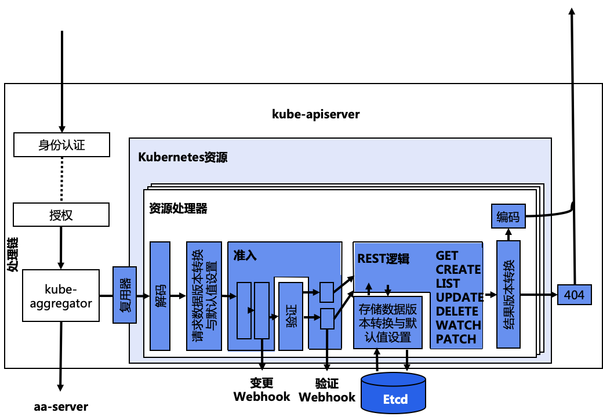

# aaserver

## 简介

aaserver（aggregated-apiserver）的设计思路是允许用户编写一个自定义的 apiserver，在这里面添加自定义 API。这个 APIServer 就可以跟 k8s 原生的 kube-apiserver 绑定部署在一起统一提供服务了。同时，构建出的 API 接口更加规范整齐，能利用 k8s 原生的认证、授权、准入机制。

不同于 CRD，aa-server 中的 API 资源是通过代码向 k8s 注册资源类型的方式实现的，而 CRD 是直接通过 yaml 文件创建自定义资源的方式实现的。因此 aa-server 有着更大的自由度，没有太多限制。

### 使用场景

- 非 Etcd 存储
- 支持 protobuf，而非只有 JSON
- 需要扩展 /status 和 /scale 子资源，如 /logs、/port-forward 等
- 可以用 Go 高效实现所有操作，包括验证、准入和转换，尤其是支持大规模场景

### vs. CRD

使用CRD：
1. 不需要编程
2. 需要实现 CRD controller，可以使用任何编程语言
3. 不需要额外的 aaserver，不需要理解 API 聚合的概念

使用API聚合（Aggregation）：
1. 需要 Go 编程
2. 可以对 API 行为进行更细粒度的控制，如数据如何存储、如何在 API 版本之间转换
3. 需要运行额外的 aaserver 进程
4. 需要自己处理多版本 API 的支持

## 架构

### kube-apiserver

kube-apiserver 是 kubectl 或其他 API 客户端请求的入口。 

#### handling filter

##### 出错恢复

##### 请求超时

##### Auth 认证

##### Audit 审计

##### 切换身份

##### 限流

##### Authz 授权

#### kube-aggregator

kube-aggregator 在 kube-apiserver 中用于用于代理、转发 aa-server 请求。它知道 自定义的 aa-server 以及它提供的 API 资源，以便正确地转发请求到对应的 aa-server 上。

##### APIService CRD

kube-aggregator 为 aa-server 的 APIService 提供发现服务 `/apis` 和 `/apis/group-name`，它无需联系 aa-server 而是通过 APIService 提供的信息来生成结果。

为了让 kube-aggregator 知道一个自定义的 aa-server 能提供哪些 API 服务，必须在 `apiregistration.k8s.io/v1` 组下创建一个 APIService 对象。APIService 对象指向一个服务，这个服务可以是 k8s 中的 ClusterIP。

APIService 的 caBundler 字段用于配置 kube-aggregator 能信任的 aa-server，这个 CA 包含了用于 aa-server 所使用的证书。

#### resource filter

真正对 REST resource 进行的处理。

##### Decode 解码

将外部请求格式（如 JSON）进行反序列化，转换成内部数据结构。

##### Scheme

Scheme 用于存储 GVK（Kind 的不同版本）以及它们之间的转换 Conversion() 及默认值处理 Defaults() 函数。它通过 install/install.go 调用每个 register.go 的 AddToScheme() 将该每个组的每个 GVK 注册到 scheme 中。

##### 版本转换&默认值设置

这部分的主要工作是将外部版本转换为 int 版。

- 默认值设置：对外部版本未设值的字段填充，其代码在 defaults.go 文件中。
- 版本转换：将收到的外部版本（如 v1）转换成内部版本（如 int），其代码在 conversion.go 文件中。

##### Admission Control

Admission 是针对内部版本实现的，不需要为每个外部版本实现一次。变更 Admission 使用 Admit() 函数，而验证 Admission 使用 Validate() 函数，其代码在 `apis/group-name/validation/validation.go` 内。

- 初始化：每个 Admission plugin 都在 admission.go 文件中有个 ValidateInitialization() 函数，用于为 Admission 做初始化准备（主要是外部资源的准备）。它会在 Options.ExtraAdmissionInitializers 中被设置，并在启动时被调用。
- 注册：每个 Admission plugin 都在 admission.go 文件中有个 Register() 函数。在 Options.Complete() 中会调用 Register() 注册 plugin。
- Admission Webhook：可以通过外部 webhook 实现 admission 的判断逻辑。

##### Registry

用于注册对外的 REST 接口，代码一般位于 `pkg/registry/group-name/` 下。

可以通过 Strategy 对 Registry 进行一定程度的定制。

一般是建立一个名为 genericregistry.Store 的 Registry 对象，然后通过 NewStrategy() 创建一个 Strategy 并插入 Registry 实例 Store，从而实现 create、update 和 delete 操作。最终通过 `type REST struct {}` 获得该 Registry。

##### REST Mapper

如果 API 提供了某个 REST 功能（CRUD），则 REST 的 registry 会注册该接口。

同时会通过 completedConfig.New() 创建该 GVR 的 APIGroupInfo，APIGroupInfo 会引用通过 Strategy 自定义过的 Registry。对于每个 GVK，都可以通过以及实现好的构造函数创建一个 Registry 实例，并在启动 apiserver 时安装这些 APIGroupInfo（InstallAPIGroupd()）。

- 转换 Webhook：通过外部 webhook 实现不同 CRD 版本的资源转换
- 默认值设置：
- Etcd 存储：

##### 版本转换

将内部版本（如 int）转换成对外外部版本（v1）

##### Encode 编码

将内部数据结构进行序列化，转换成外部请求格式（如 JSON）。

### vs. aaserver

aaserver 与 kube-apiserver 都是基于 `k8s.io/apiserver` 这个库来实现的。但最大的区别在于 aaserver 依赖于一个 k8s 集群运行，有一个可用的 kube-apiserver 来代理或获取其他 k8s 资源。kube-aggregator 在 kube-apiserver 中用于用于代理、转发 aaserver 请求。其处理流程包括：

- kube-apiserver 收到请求
- kube-apiserver 的 handling filter 进行处理，包括 auth、audit、用户切换、限流和 authz
- kube-aggregator 代理、转发 aa-server 提供的 API 服务给 aaserver

### aaserver

aaserver 与 kube-apiserver 有着相同的结构，区别在于没有嵌入 kube-aggregator 和 apiextension-apiserver。

#### handling filter

aaserver 拥有自己的 handling filter：包括身份认证、日志审计、用户切换、限流和授权，但有些操作会委托给 kube-apiserver 来处理

##### auth 委托

由于 aaserver 位于 kube-apiserver（kube-aggregator）之后，所以请求到达 aa-server 时已经被 kube-apiserver 认证过了。kube-apiserver 会将认证的结果放在 HTTP header 里，通常是 X-Remote-User 和 X-Remote-Group 中。

aaserver 通过客户端 CA 对这些 header 进行认证，通过 TokenAccessReview 委托 kube-apiserver 进行身份认证。

##### audit

自己进行 audit

##### authz 委托

通过 SubjectAccessReivew 委托 kube-apiserver 进行授权。

aaserver 通过 SubjectAccessReview 委托给 kube-apiserver 进行授权。而 kube-apiserver 收到请求后，会基于集群的 RBAC 规则做出判断，返回一个 SubjectAccessReview 对象，并设置对应 status。

#### resource filter

aaserver 拥有自己的 resource filter：包括解码、转换、准入、REST mapper 和编码

- 拥有自己的 REST 注册表：
- 调用准入 webhook：
- 数据写入 Etcd：

#### resource 添加

之前的 CRD 不同，aaserver 的 resource 添加是 hard-code 在 `pkg/apiserver/apiserver.go` 文件中的。当通过 `completedConfig.New()` 创建 server 时，通过 aipGroupInfo 结构体定义 resource，并包含不同版本，让后由 `GenericAPIServer.InstallAPIGroup(&apiGroupInfo)` 进行添加。

### Admission Control

【1】

## 代码

### apiserver库

[kubernetes/apiserver](https://github.com/kubernetes/apiserver) 同步自k8s 主代码树的 taging/src/k8s.io/apiserver 目录，它提供了创建 k8s 风格的API Server 所需要的库。包括 kube-apiserver、kube-aggregator、service-catalog 在内的很多项目都依赖此库。

apiserver 库的目的主要包括：

1. 将 authn/authz 委托给主 kube-apiserver
2. 支持 kuebctl 兼容的API发现
3. 支持 admisson control 链
4. 支持版本化的 API 类型

## Lab

### sample-apiserver

- [sample-apiserver](10_sample-apiserver/.bak/README.md)：k8s 提供了一个样例 [sample-apiserver](https://github.com/kubernetes/sample-apiserver)，这个例子依赖于主 kube-apiserver。即使不使用 authn/authz 或 kube-aggregator，也是如此。在启动时需要通过 `--kubeconfig` 来指向一个主 kube-apiserver，样例中的 `SharedInformer` 会连接到主 `kube-apiserver` 来访问 k8s 资源。

### custom-aaserver

- [custom-aaserver]()

## Ref

1. [K8S风格的Operator模式](https://iwiki.woa.com/pages/viewpage.action?pageId=1440218670)

