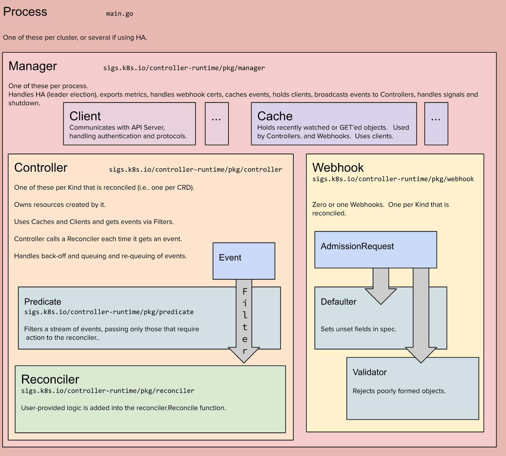

# kubebuilder

## 简介


## 架构

### Manager




### Controller


### Webhook


### Cluster

#### Client


#### Cache


## Dev

### group/version/xx_types.go

建立、更新 CRD 对应的 struct


### controller/kind/xx_controller.go

在 Reconcile() 中写入核心业务逻辑


## Lab

### kubebuilder-demo

- 初始化 kubebuilder
```shell
kubebuilder init --domain wukong.com --repo github.com/rebirthmonkey/kubebuilder-demo
```

- 创建 API
```shell
kubebuilder create api --group ingress --version v1 --kind App
```

- install CRDS
```shell
make install
```

- 在 controller/Reconcile() 中添加代码
```go
    _ = log.FromContext(ctx)
	fmt.Println("XXXXXXXX app changed", "ns", req.Namespace)
	return ctrl.Result{}, nil
```

- run operator
```shell
make run  
```

- 添加 CR
```shell
kubectl delete -f config/samples/ingress_v1beta1_app.yaml 
```

### kubebuilder-cronjob

```shell
kubebuilder init --domain wukong.com --repo github.com/rebirthmonkey/k8s-dev/kubebuilder-cronjob

```

```shell
kubebuilder create api --group batch --version v1 --kind CronJob
```