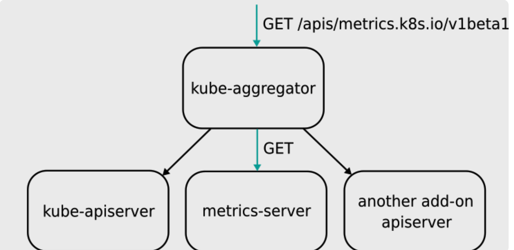
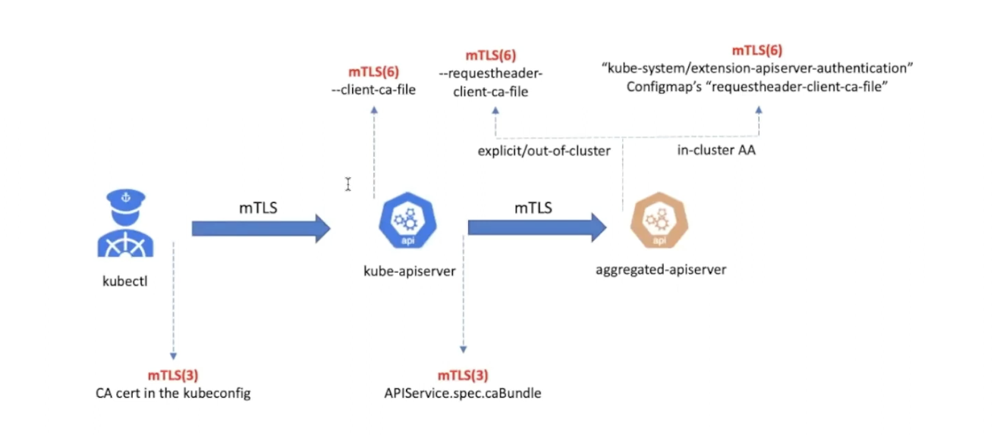

# Aggregate API

## 简介

APIServer Aggregator的设计思路是允许用户编写一个自定义的 APIServer，在这里面添加自定义 API。这个APIServer就可以跟k8s原生的APIServer绑定部署在一起统一提供服务了。同时，构建出的API接口更加规范整齐，能利用k8s原生的认证、授权、准入机制。

不同于CRD，Aggregated APIServer中的API资源是通过代码向k8s注册资源类型的方式实现的，而CRD是直接通过yaml文件创建自定义资源的方式实现的。

Configuring the aggregation layer allows the Kubernetes apiserver to be extended with additional APIs, which are not part of the core Kubernetes APIs.

Unlike CRDs, the Aggregation API involves  another server - your Extension apiserver - in addition to the standard  Kubernetes apiserver. 

- **kube-aggregator**: It is the controller associated with apiregistration API and  constitutes what we call the aggregation layer. It is responsible for  discovering and registering extension apiservers and acting as a **front-proxy** to the individual extension apiservers.
- **extension-apiserver**: API servers written using the library [kube-apiserver](https://github.com/kubernetes/apiserver). Provides a way of defining custom APIs that are deeply integrated with core Kubernetes API machinery. [Compared](https://docs.google.com/document/d/1y16jKL2hMjQO0trYBJJSczPAWj8vAgNFrdTZeCincmI/edit#heading=h.qzaj1hoslggu) to [CRDs](https://kubernetes.io/docs/concepts/extend-kubernetes/api-extension/custom-resources/), it offers more features and options for dealing with performance, policy and customization.

A request to an API path that is served by an extension apiserver begins the same way as all API requests: communication to the Kubernetes  apiserver. This path already has been registered with the Kubernetes  apiserver by the extension apiserver. The high-level flow is as follows:

1. Kubernetes apiserver: authenticate the requesting user and authorize their rights to the requested API path.
2. Kubernetes apiserver: proxy the request to the extension apiserver
3. Extension apiserver: authenticate the request from the Kubernetes apiserver
4. Extension apiserver: authorize the request from the original user
5. Extension apiserver: execute

### delegated authN

The Kubernetes apiserver will need to communicate with your extension  apiserver, and your extension apiserver will need to communicate with  the Kubernetes apiserver. In order for this communication to be secured, the Kubernetes apiserver uses x509 certificates to authenticate itself  to the extension apiserver.

The mechanism where-in API calls to the extension-apiserver are  authenticated & authorized by the core kubernetes apiserver  (kubernetes master)

The Kubernetes apiserver connects to the extension apiserver over  TLS, authenticating itself using a client certificate. You must provide  the following to the Kubernetes apiserver upon startup, using the  provided flags:

- private key file via `--proxy-client-key-file`
- signed client certificate file via `--proxy-client-cert-file`
- certificate of the CA that signed the client certificate file via `--requestheader-client-ca-file`
- valid Common Name values (CNs) in the signed client certificate via `--requestheader-allowed-names`

The Kubernetes apiserver will use the files indicated by `--proxy-client-*-file` to authenticate to the extension apiserver. In order for the request to be considered valid by a compliant extension apiserver, the following  conditions must be met:

1. The connection must be made using a client certificate that is signed by the CA whose certificate is in `--requestheader-client-ca-file`.
2. The connection must be made using a client certificate whose CN is one of those listed in `--requestheader-allowed-names`.

When started with these options, the Kubernetes apiserver will:

1. Use them to authenticate to the extension apiserver.
2. Create a configmap in the `kube-system` namespace called `extension-apiserver-authentication`, in which it will place the CA certificate and the allowed CNs. These in turn can be retrieved by extension apiservers to validate requests.

Note that the same client certificate is used by the Kubernetes apiserver to authenticate against *all* extension apiservers. It does not create a client certificate per  extension apiserver, but rather a single one to authenticate as the  Kubernetes apiserver. This same one is reused for all extension  apiserver requests.

When the Kubernetes apiserver proxies the request to the extension  apiserver, it informs the extension apiserver of the username and group  with which the original request successfully authenticated. It provides  these in http headers of its proxied request. You must inform the  Kubernetes apiserver of the names of the headers to be used.

- the header in which to store the username via `--requestheader-username-headers`
- the header in which to store the group via `--requestheader-group-headers`
- the prefix to append to all extra headers via `--requestheader-extra-headers-prefix`

These header names are also placed in the `extension-apiserver-authentication` configmap, so they can be retrieved and used by extension apiservers.

### delegated authZ

AA server delegates authz to kube-apiserver, via `authorization.k8s.ios.SubjectAccessReview` API

The extension apiserver now can validate that the user/group  retrieved from the headers are authorized to execute the given request.  It does so by sending a standard SubjectAccessReview request to the Kubernetes apiserver.

In order for the extension apiserver to be authorized itself to submit the `SubjectAccessReview` request to the Kubernetes apiserver, it needs the correct permissions. Kubernetes includes a default `ClusterRole` named `system:auth-delegator` that has the appropriate permissions. It can be granted to the extension apiserver's service account.

### admission control

AA server delegates admisssion controllers to kube-apiserver, via `admission.k8s.ios.AdmissionReview` API

### Non-ETCD Persistent Layer

### Setup an AA Server

Setting up an extension API server to work with the aggregation layer  allows the Kubernetes apiserver to be extended with additional APIs,  which are not part of the core Kubernetes APIs.

## sample-apisrver

it comes with the custom resources `Flunder` & `Fischer `under the `wardle.k8s.io` apigroup. 

### Lab

