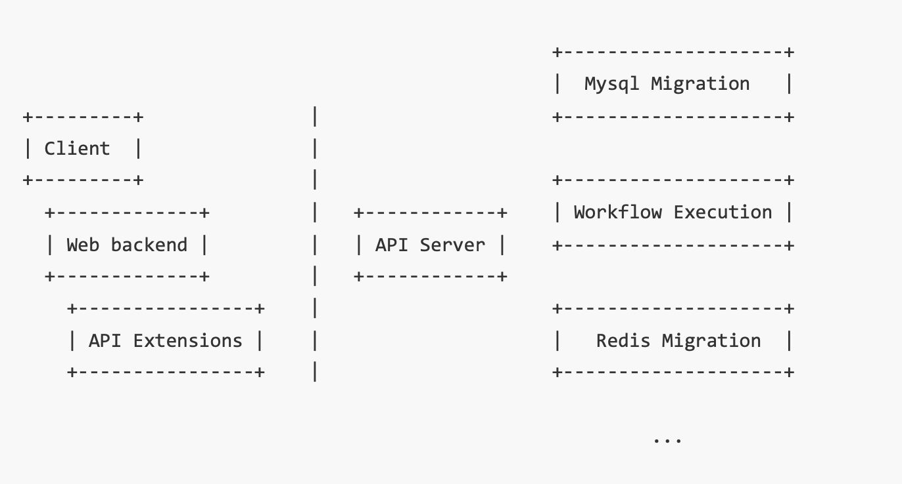

# kubecontroller

## 架构

### 应用功能架构

一个完整的基于 k8s controller 的应用功能架构如下图，分割线左边的部分是 web 应用的组件，而右边则是 k8s Operator 模式的通用组件：

- Client：浏览器。
- Web backend：Web 后端，负责与 client 直接交互。
- APIExtensions：一个用来将 k8s 风格的 API 简化为资源状态的服务，通常情况下只给 Web backend 提供简便。
- APIServer：k8s 的 APIServer，它是整套 k8s controller 的功能入口。
- Reconcilers：最右边那些小方块，接收资源创建/改变/删除事件响应具体操作的一系列 Worker。



## Controller

### ReconcilerApp

整个应用的接入点，可以封装多个 Manager，这里封装了 ReconcilerManager。它采用了 OCA 应用框架。

ReconcilerApp/Manager 用于封装任何类型的 Manager，这里封装了 ReconcilerManager。

### ReconcilerManager

#### ReconcilerBuilder

ReconcilerBuilder 的本质是用于初始化 Reconciler struct 的回调函数列表，它 SchemeBuilder 设计模式，先通过 registry.Register() 注册一堆用于初始化各种 API 资源的 Reconciler struct（通过回调函数），然后通过 register.AddToManager() 执行所有回调函数实现真正的 API 资源 Reconciler struct 初始化。

- Register()：注册回调（callback）函数。可以注册若干回调函数，这些回调函数接受 ReconcilerManager 作为总调度器，并且为其添加 Reconciler struct。在 main() 中，以 `import _ .../reconcilers/xxx` ，通过 registry.Register() 转一道，自动将每个 reconciler 的 struct 以 Setuper 的形式（回调函数）注册到指定的 ReconcilerManager 的 ReconcilerBuilder（回调函数列表）中。
- AddToManager()：执行所有回调函数。ReconcilerManager 的回调行为要延迟到 AddToManager() 的那一刻才真正执行。在 ReconcilerApp.Manager.Run() 中，通过 registry.AddToManager() 转一道，再调用 ReconcilerBuilder.AddToManager() 执行。

registry 是 Reconciler struct 转换到 ReconcilerManager 的一层转换胶水。

#### ReconcilerSetuper

ReconcilerSetuper 相当于规定了安装新的 Reconciler struct 到 RMgr 的接口，其作用有 1/ 添加 Reconciler 到 RMgr 中进行缓存，2/ 在 RMgr 缓存同步后统一将 RMgr 的 Reconciler 们安装到 k8s 的 runtime-controller/Manager。

- With() 添加：将一个 ReconcilerSetuper 添加到 ReconcilerSetuper 列表中。
- Setup() 安装：将 ReconcilerSetuper 列表中的每个  ReconcilerSetuper，通过 SetupWithManager(mgr) 正式在 RMgr.Manager（k8s 原生的 runtime-controller/Manager） 中安装。

#### ReconcilerManager

ReconcilerManager 封装了 k8s 原生的 runtime-controller/Manager。其 struct 主要包括：

- 配置信息：
- ReconcilerSetuper 列表：
- k8s runtime-controller/Manager：
- enabledControllers 列表：

其具体操作包括：

- With()：对应 ReconcilerSetuper 的 With()，将一个 ReconcilerSetuper 添加到 ReconcilerSetuper 列表中 
- Setup()：对应 ReconcilerSetuper 的 Setup()，正式安装 ReconcilerSetuper 列表中的所有 Setuper。
- Run()：启动整个 ReconcilerManager，通过 k8s Manager 的 Start() 函数启动。

ReconcilerManager 封装 k8s 原生 Manager的主要目的是：

- 隐藏一些原生 Manager 的初始化的细节。
- 提供了一种在缓存同步后，执行回调的机制。
- 提供可以根据配置文件来启用、禁止某些 Reconciler 的机制。
- 支持资源过滤，仅仅让 Reconciler 看到一部分资源。

### 单个Reconciler

#### apis/types.go

用于定义各种 k8s 的 API 资源。

##### ResourceMetadatas

ResourceMetadatas 是为了兼容独立 APIServer 和 k8s crd 设置的元数据，后续 SDK 会自动生成 kubebuilder 注解，保证工具在 2 种部署方式下行为一致。

#### Reconciler

基于 kubebuilder 原生的 Reconciler 基本一致，它主要包括 Reconciler struct。

其具体操作包括：

- init()：对应 ReconcilerApp 的
- SetupWithManager()：将该 Reconciler（内部称为 Controller）添加到 Manager 中。
- Reconciler()：循环处理的核心业务逻辑。

#### 运行

##### 事先准备

- go mod

```bash
go mod tidy
```

- controller-gen：

```shell
go install sigs.k8s.io/controller-tools/cmd/controller-gen@v0.9.2
controller-gen -h 
```

##### 运行单个Reconciler

- 配置 kind k8s 集群

```bash
kind create cluster --name xxx
kubectl cluster-info --context kind-xxx
kubectl config get-contexts
kubectl config use-context kind-xxx
kubectl cluster-info

Kubernetes control plane is running at https://127.0.0.1:60004
CoreDNS is running at https://127.0.0.1:60004/api/v1/namespaces/kube-system/services/kube-dns:dns/proxy
```

- 向集群注册 AT CRD

```bash
kubectl apply -f manifests/at/demo.wukong.com_ats.yaml
```

- 启动 AT Reconciler

```bash
go run cmd/reconcilers/at/main.go -c configs/kubecontroller.yaml
```

- 验证 AT Reconciler

```bash
kubectl apply -f manifests/at/cr.yaml
```

#### 开发步骤

简单提一下实际开发的步骤：

- 定义 API 资源。
- 实现 Reconciler 接口。
- 为 API 资源生成标准的 API Extension 以及定义必要的 HTTP 接口。
- 定义 Web backend 对外提供的接口。

##### 定义API资源

生成 Go Type 文件：

- 创建 `xxx_type.go` 文件，并定义 `xxx` 与 `xxxList` 结构体，并且 register 该结构体
- 构建 DeepCopy

```shell
bin/controller-gen object paths="./..."
```

##### 实现Reconciler接口

在 `pkg/reconcilers/xxx/xxx.go` 文件内编写：

- init()：
- reconcile() 的逻辑

##### 创建cmd


##### 创建manifests

- 自动生成 CRD

```shell
controller-gen crd paths=./... output:crd:dir=manifests 
```

- 自定义 CR

### ReconcilerHub

用于一并启动所有的 Reconcilers。

#### 运行

通过 ReconcilerHub 运行所有的 Reconcilers。为了方便调试，采用 kind 启动 k8s 集群。

- 配置 kind k8s 集群

```bash
kind create cluster --name xxx
kubectl cluster-info --context kind-xxx
kubectl config get-contexts
kubectl config use-context kind-xxx
kubectl cluster-info

Kubernetes control plane is running at https://127.0.0.1:60004
CoreDNS is running at https://127.0.0.1:60004/api/v1/namespaces/kube-system/services/kube-dns:dns/proxy
```

- 向集群注册 CRD

```bash
kubectl apply -f manifests/...
```

- 启动 ReconcilerHub：通过 ReconcilerHub 启动所有 Reconciler。

```bash
go run cmd/hub/main.go --config ./configs/kubecontroller.yaml
```

### 单个PMReconciler

#### 运行

以 redismigrations 为例： 

- 将 context 转到对应的 k8s 集群
- 注册 CRD

```bash
kubectl apply -f chart/crds/database.cloud.tencent.com_redismigrations.yaml
```

- 单独启动 Reconciler：

```bash
# 如果KUBECONFIG存放在非默认位置，请指定 --kubeconfig 命令行选项
go run cmd/controllers/redismigration/main.go --zap-log-level=4 --config=config/teleport.yaml
```

- 创建 CR 资源测试 Reconciler：

```bash
kubectl apply -f - <<EOF
apiVersion: database.cloud.tencent.com/v1
kind: RedisMigration
metadata:
  name: rmtest
  namespace: default
spec:
  source: ali-123
  dest: tx-123
EOF
```

## APIExt

因为除了 k8s 风格的 API 接口外，有时需要采用传统的 REST 风格的接口，因此在 kubecontroller 设计的时候，同时采用了基于 Gin 的 APIExt 接口，用于简化 k8s 接口。

## 定制APIServer

定制 APIServer 是在目标环境没有 k8s 集群的情况下，通过定制的 APIServer 来保证让 reconciler 正常运行。

### 运行

- 启动 APIServer：可能需要再 main.go 中手动调 https 的 port。

```bash
go run cmd/apiserver/main.go
    # 存储后端，可选etcd, file                                                                
    --backend=file
    # 如果使用etcd存储后端，需要指定etcd服务器URL
    --etcd-servers=http://etcd.gmem.cc:2379
    # 如果使用file存储后端，需要指定存储路径
    --file-rootpath=/tmp/teleport 
    # 静态token位置
    --token-auth-file=$PROJECT_DIR/config/token.csv
    
    # 以下可选
    # 不受限制的更新，允许同时更新主资源、子资源
    --unrestricted-update=true
    # 日志冗长级别
    -v=10
    # 是否禁止kubectl访问
    --kubectl-disabled=false
    # 是否禁止kubectl使用静态Token访问，即要求总是使用临时Token
    --kubectl-ephemeral-token=false
    # 是否允许localhost不需要身份验证即可访问
    --authn-allow-localhost=true
    
go run cmd/apiserver/main.go --backend=etcd --etcd-servers=http://127.0.0.1:2379  --request-timeout=60m --token-auth-file=config/token.csv --unrestricted-update=true -v=10 --kubectl-disabled=false --kubectl-ephemeral-token=false --authn-allow-localhost=true
```

- 初始化

```bash
kubectl -s http://127.0.0.1:6080 apply -f initialization/namespaces
kubectl -s http://127.0.0.1:6080 apply -f initialization/catalogs
kubectl -s http://127.0.0.1:6080 apply -f initialization/binmetas
kubectl -s http://127.0.0.1:6080 apply -f initialization/teams
kubectl -s http://127.0.0.1:6080 apply -f initialization/users
```

- 通过 kubectl 使用 APIServer：

```bash
kubectl -s http://127.0.0.1:6080 -n default get users
```

## 扩展机制

### PhaseMachine

因为 Reconciler 本质是基于 event，在不同的 state 之前流转（state machine），因此可以基于 Reconciler 设计一个 State Machine 的框架，方便不同状态间的流转，也就是 PM（PhaseMachine）框架。PM 其实是在 k8s 的 controller-runtime 外封装一层，添加了不同 phase 的数据结构。

基于 PM 实现的 Reconciler，需要在 Reconcile() 方法中处理各个 phase 的状态流转。Phase 建模建议包含以下状态：

- Pending/Initializing/Uninitialized：在此阶段，收集初始化信息。
- Precheck/PreFlight/DryRun：在此阶段，进行一些预检。
- Migrate/InFlight/Run：在此阶段，执行实际的业务逻辑。
- PreFailed：终止状态，表示预检阶段失败。
- Failed：终止状态，表示业务逻辑阶段失败。
- Succeeded：终止状态，表示业务逻辑成功。

在具体开发 Reconciler 时，每个 Phase 对应一个 Handler 处理函数，处理函数驱动 Phase 之间的变换。开发新的 Reconciler，实际上就是实例化一个 PhaseMachine 结构，并提供 1/ Phase 建模、2/ 状态转换矩阵、3/ Phase 处理函数。

通常需要为每个 Reconciler 对应一个独立的包，如 reconcilers/pmdemo，并在此包中对 PhaseMachine 做一层简单的 wrapper。这个 wrapper 的目的是传入一些控制参数、上下文对象。

### Web-Backend


## Tmp

### 运行单个 Reconciler

- XXX 启动 web backend

```bash
go run web/backend/main.go --user-config config/teleport-web.yaml
```

- 启动 web frontend：修改 proxy['/wapi'] 中的 target 到正确的地址，指向 127.0.0.1:6081。

```bash
npm install --registry=https://mirrors.tencent.com/npm/
npm run dev
```

- 本地浏览器访问：`http://127.0.0.1:8000`，默认的用户名密码是 `admin:teleport`。


