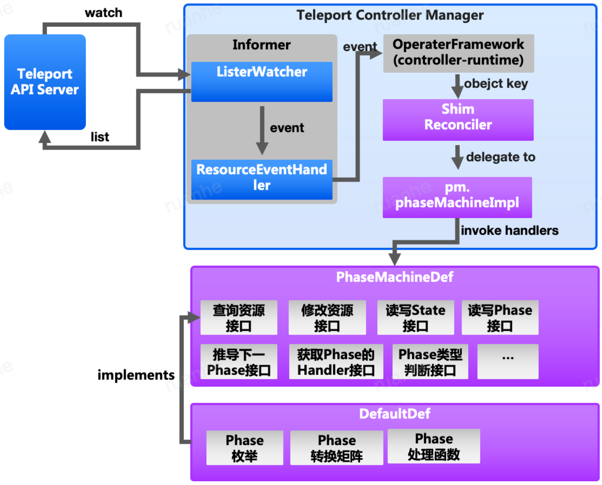

# PhaseMachine框架

## 简介

Operator 模式随着 k8s 的广泛应用而被大家熟知。广义上说，但凡提供声明式 API、采用逐步逼进的事件处理循环，让实际状态趋向并最终达成期望状态的开发模式，都可以看作是 operator 模式。狭义角度来说，Operator 模式是指，提供 k8s 风格的 API（实现方式包括 CRD、AA），并基于 k8s 的客户端库编写代码，读取期望状态（API 资源的 Spec 字段），进行各种运维操作，最终让实际状态（API 资源的 Status 字段）和期望状态匹配。

PhaseMachine 框架是专门用于开发 Operator 的框架，实现了狭义上的 Opeator 模式。基于 PhaseMachine，开发人员只需要实现 PhaseMachineDef 接口，它将接口转换为配置，开发者只需要为 DefaultDef 指定各种配置即可。每个 PhaseMachineDef 负责处理一种 k8s API 资源。

### 基本概念

#### Phase

PhaseMachine 的设计理念，是基于这样的假设：Operator 的业务逻辑中，通常可以分为几个明确的、职责分明的阶段。这里的阶段就是 Phase，典型阶段包括：预检（Precheck）、执行（Action）、确认（Confirm），以及一些辅助的 Phase：初始化（Initialize）、成功（Succeeded）、失败（Failed）。Phase 是 PhaseMachine 最重要的概念，PhaseMachine 的本质就是在各个 Phase 之间进行流转的 State Machine。Phase 本质上就是 string 类型变量，取值由 PhaseMachine 的使用者自行设计。

- 起始 Phase：新启动的 PhaseMachine 处于该 Phase。
- 终止 Phase：PhaseMachine 到达此类 Phase 后，运维过程终止。终止 Phase 分为两类：成功类 Phase、失败类 Phase。

#### Handler

在每个阶段，业务逻辑都需要做一些事情，这个事情的载体就是 Handler。每个非辅助 Phase，都对应唯一一个 Handler。Handler 自身支持组合模式，也就是一个 Handler可以由 N 个 ComponentHandler 构成。这些 ComponentHandler 自身亦可使 CompoundHandler。这可以构成复杂的 Handler 树，每个节点负责一个职责，这种 Handler 树在做预检时很有用。一个 Phase 的直接 Handler，称为 Root Handler。

ComponentHandler 的执行方式有两种：

- 并行执行：发动 goroutine，在后台执行这些 ComponentHandlers。当任何一个 Handler 失败，所有 Handler 都有机会通过 channel 获取该信息，进而停止不必要的工作。
- 串行执行：一个个的执行，一旦出现失败，则立即停止。

Handler 具有一系列元数据，和框架核心有关的是 Name：

- 框架的使用者可以显式指定 Handler 的名称
- 应当为所有非 Root Handler 显式指定名称
- Root Handler 的名称默认为 Phase 的名称
- 如果 Handler 来自一个非匿名函数，则该函数的名字作为 Handler 的名称。显然compound handler不是函数，无法获得默认名称

#### ReconcileState

每个 Handler，其执行后的返回结果都是 ReconcileState。该结构说明本次 Handler 的执行结果，大部分字段由框架使用，框架的使用者无需关心，除了一下字段：

- Done：告知框架本 Handler 的任务是否全部完成。如果为 false，则框架会在下次事件循环重入该Handler。
- Updated：告知框架本 Handler 是否修改了 API 资源的状态，需要入库。一般情况下不需要设置该字段，框架会自动判断是否修改了 Resource 的状态。
- Error：Handler 执行过程中出现的错误。
- Next：提示框架强制跳转到目标 Phase。一般不会使用，关于 Phase 的变换，参考下文。

ReconcileState 和 Handler 一一对应，由于 Handler 实现了组合模式，ReconcileState 也自然实现该模式，以反映整个 Handler 树的状态。同样的，这是框架技术细节，框架的使用者无需关心，也看不到。

对于 CompoundHandler，其 ReconcileState 由框架自动生成，规则如下：

- Done：如果所有 ConmonentHandler 都 Done。
- Updated：如果任何一个 ComponentHandler Updated。
- Error：所有出错的 ComponentHandler 的 Error 数组，如果只有单个错误，则不使用数组。

#### State

Handler 会接收到一个 State 类型的入参，这个参数反映了 Handler 上次运行（未完成而重入了，就是 Done 为 false）的执行情况。Handler 上次运行的结果，也就是 ReconcileState 中的信息，经过框架梳理后会保存到 API 资源的 Status 中，默认情况下它会保存到 Status.State 字段。State 也实现了组合模式，以反映整个 Handler 树的状态执行情况。

一个 Phase 的 State 就是该 Phase 的 Handler 的 State。Status.State 字段是一个 Map，其键是 Phase 的 Handler 的名称（也就是 Phase 的名称），该字段的类型必须是和 State 结构等价的结构 —— 包含类型、名字相同的字段。特别是，该结构实现组合模式，它必须有个名为 state 的字段，其类型和 Status.State 一致，键是 ComponentHandler 的名称、值是 ComponentHandler 的 State。

#### Phase变换

一个 PhaseMachine 必须在运行一段时间后，最终到达一个终止 Phase。每个 Phase 都具有自己的 Handler，Handler 的处理结果 ReconcileState，决定了跳转到哪个新的 Phase。这个逻辑由 PhaseMachineDef.NextPhase() 方法实现。

如果使用 DefaultDef，则不需要实现 NextPhase，而是需要提供 Phase 变换矩阵：它决定了，在任何一个 Phase 的 Handler 成功或失败的情况下，应该跳转到什么 Phase。

此外，Handler 可以在 ReconcileState.Next() 中强制指定跳转目标，尽管很少这么做。

#### Status

这个术语是指 API 资源的状态，一般都是 Status 字段。Status 是 Phase、State 的存储载体。

### 架构

PM 架构图如下，在 KubeBuilder Reconciler 外封装了一层，紫色部分是 PM 的核心：



#### pm.PhaseMachineImpl

pm.PhaseMachineImpl 实现了 Reconciler 接口，但是它不是标准的 Operator，PhaseMachine 框架的用户还需要实现一个垫片控制器（Shim Reconciler），它是 Operator Framework 和 PhaseMachine 框架之间的桥梁：

- 负责将 pm.PhaseMachineImpl 包装为标准的 Operator，并注册到控制器管理器。
- 负责准备 PhaseMachine 所有方法都需要使用的上下文对象 context.Context。

pm.PhaseMachineImpl 实现了 PhaseMachine 控制循环 ，由于 Shim 机制的存在，它可以完全独立于 APIServer、controller-runtime/client-go 等库独立运行，很大程度上方便了单元测试。

#### PhaseMachineDef

pm.PhaseMachineImpl 需要一个 PhaseMachineDef，后者的缺省实现是 DefaultDef。PhaseMachineDef 以实现接口的形式，指定 PhaseMachine 的各种行为。DefaultDef 则变为以配置的形式，指定 PhaseMachine 的行为。

## 代码

因为 Reconciler 本质是基于 event，在不同的 state 之前流转（state machine），因此可以基于 Reconciler 设计一个 State Machine 的框架，方便不同状态间的流转，也就是 PM（PhaseMachine）框架。PM 其实是在 k8s 的 controller-runtime 外封装一层，添加了不同 phase 的数据结构。

基于 PM 实现的 Reconciler，需要在 Reconcile() 方法中处理各个 phase 的状态流转。Phase 建模建议包含以下状态：

- Pending/Initializing/Uninitialized：在此阶段，收集初始化信息。
- Precheck/PreFlight/DryRun：在此阶段，进行一些预检。
- Migrate/InFlight/Run：在此阶段，执行实际的业务逻辑。
- PreFailed：终止状态，表示预检阶段失败。
- Failed：终止状态，表示业务逻辑阶段失败。
- Succeeded：终止状态，表示业务逻辑成功。

在具体开发 Reconciler 时，每个 Phase 对应一个 Handler 处理函数，处理函数驱动 Phase 之间的变换。开发新的 Reconciler，实际上就是实例化一个 PhaseMachine 结构，并提供 1/ Phase 建模、2/ 状态转换矩阵、3/ Phase 处理函数。

通常需要为每个 Reconciler 对应一个独立的包，并在此包中对 PhaseMachine 做一层简单的 wrapper。这个 wrapper 的目的是传入一些控制参数、上下文对象。

### pm.PhaseMachineImpl结构

该结构是 PhaeMachine 和 Operator 模式之间的桥梁。它实现了 Reconciler 接口，其本身就是一个Operator。其 Reconcile 方法实现了 PhaseMachine 的核心逻辑：

- 根据 API 资源的 Key，从 APIServer 读取 PhaseMachine 资源。
- 获取 API 资源所处的 Phase，然后查找该 Phase 的 Handler。
- 获取该 Phase 的 State，然后调用 Handler，传入 State。
- 根据 Handler 的 ReconcileState，生成新的 Stae 并入库，并调用 NextPhase() 跳转到下一 Phase。

重复上述过程，直到进入终止 Phase。

### PhaseMachineDef接口

该接口是框架的核心，每个新开发的 PhaseMachine，实际上就是实现该接口：

```go
// PhaseMachineDef defines a phase machine
type PhaseMachineDef interface {
    // FetchResource  fetch resource by key from backend storage  如何从后端存储，一般是APIServer，读取API资源
    FetchResource(ctx context.Context, key string) (Resource, error)
    // PersistStatus save status of the specified resource in backend storage   如果将API资源状态持久化到后端存储
    PersistStatus(ctx context.Context, res Resource) error
    // GetStatus get resource status    如何获取API资源的Status字段
    GetStatus(res Resource) interface{}
    // GetPhase get current phase   如何获取、写入API资源的Phase
    GetPhase(res Resource) Phase
    // SetPhase set next phase
    SetPhase(res Resource, phase Phase)
    // NextPhase deduce next phase with information provided by the reconciling state  Phase变换，根据Phase的Handler的返回结果，判断下一Phase是什么
    NextPhase(rstate ReconcileState) Phase
    // GetState get current state  如何获取、更新API资源的State
    GetState(res Resource, phase Phase) State
    // UpdateState invoked after a phase handler succeeded or fatally failed
    UpdateState(res Resource, phase Phase, state State)
    // IsTerminal checks if the specified phase is a terminal phase    判断某个Phase是否为终止Phase
    IsTerminal(phase Phase) bool
    // IsFatal checks if an error is fatal    判断一个错误是否为致命错误
    IsFatal(err error) bool
    // HandlerFor get reconcile action for the specified phase   获取某个Phase的Handler
    HandlerFor(phase Phase) Handler
    // ForEachHandler iterates over all phases with handler attached  迭代所有Pahse + Handler的组合
    ForEachHandler(func(phase Phase, handler Handler))
    // GetRequeueDefer returns defer before retrying ( on non-fatal error )  非致命错误重试时，重新入队的延迟
    GetRequeueDefer() time.Duration
}
```

实现所有上述接口，pm.PhaseMachineImpl 就能够驱动 PhaseMachine 了。

### DefaultDef结构

由于 PhaseMachineDef 的大部分逻辑具有通用性，让框架用户去都去实现，工作量大而重复，因此框架提供了 DefaultDef，作为缺省实现。

这个实现将接口风格转换为配置风格，例如 PhaseMachineDef 需要实现一个 FetchResource 方法，而 DefaultDef 则需要提供一个名为 FetchResourceFunc 的函数。

```go
type DefaultDef struct {
    // ResourceType required   Resource的真实类型
    ResourceType reflect.Type
    RequeueDefer time.Duration   // 重新入队延迟时间
    // FetchResourceFunc  required    获取资源函数
    FetchResourceFunc func(ctx context.Context, key string) (Resource, error)
    // PersistStatusFunc required   存储资源函数
    PersistStatusFunc func(ctx context.Context, res Resource) error
    StatusField       string   // Status字段的名称，默认取Resource.Status字段
    // Phase getter/setter, if nil, the framework will use reflection to get/set phase   读写Phase的函数，默认直接读写Status.Phase字段
    GetPhaseFunc func(res Resource) Phase
    SetPhaseFunc func(res Resource, phase Phase)
    PhaseField   string
    // State getter/setter, if nil, the framework will use reflection to get/set state 读写State的函数，默认直接读写Status.State字段
    GetStateFunc    func(res Resource, phase Phase) (state State)
    UpdateStateFunc func(res Resource, phase Phase, state State)
    StateField      string
    // Handlers required    每个Phase的Handler
    Handlers       map[Phase]Handler
    IsFatalFunc    func(err error) bool   // 判断致命错误的函数，默认网络错误被认为是非致命的
    InitialPhase   Phase      // 初始Phase的有哪些
    TerminalPhases []Phase   // 终止Phase有哪些
    // NormalTrans, ErrorTrans required    Phase变换矩阵
    NormalTrans, ErrorTrans map[Phase]Phase
}
```

必须提供的配置项包括：

- FetchResourceFunc、PersistStatusFunc：一般使用pkg/controllers/pm/kube包中的函数生成器。
- Handlers：各 Phase 到 Handler 的映射。
- InterialPhase、TerminalPhases：初始、终止 Phase 的名字。
- NormalTrans、ErrorTrans Phase 变换矩阵：指明对于任何一个 Phase，当它的的 Handler 成功、失败时，分别应该跳转到什么 Phase。

Handler 一般也不实现接口，而是使用 HanderFunc 将一个裸函数转换为 Handler。

### Resource

```go
// Resource API resource, declares the desired state of ops
type Resource interface {
}
```

代表一个 AP I资源，框架没有进行任何假设。

### Phase

就是一个字符串：

```go
type Phase string
```

### ReconcileState

代表一个 Handler 的处理结果，非导出字段供框架使用：

```go
type ReconcileState struct {
    // Done indicates if the handler logic is done ( irrespective of the result )   Handler的工作是否都完成了
    Done bool
    // If status of the resourace has been modified ( in memory only )   Handler是否修改了Resource的状态，一般不需要设置，框架会自动判断
    Updated bool
    // If error occurred during the reconciliation   Handler执行过程中的错误
    Error error
    // Next phase, for jumping to any Phase, irrespective of trans matrix   强制跳转到目标Phase
    Next Phase
    // startTime when the handler started    处理的开始、结束时间
    startTime *metav1.Time
    // endTime when the handler ended
    endTime *metav1.Time
    // handler name of the handler     Handler的名称
    handler string
    // current phase  当前处于的Phase
    current Phase   
    // failed if the handler failed ( error is not nil )   标记是否处理失败
    failed bool
    // fatal if the error is fatal    标记失败是否致命
    fatal bool
    // components for composite handlers, this field contains ReconcileState of each component handler   框架收集component handler的执行情况
    components map[string]ReconcileState
}
```

### State

代表一个 Handler 累积的执行统计信息，这里的累积是指 Handler 一次执行可能工作没有全部完成，框架会重入此 Handler。

State 和 ReconcileState 之间有转换函数，可以认为 State 是同一个 Handler 的每次调用得到的 ReconcileState 的累积。

```go
// State phase handler ( or a component handler ) statistics, readonly to framework users
type State struct {
    // Done indicates if the handler logic is done ( irrespective of the result )
    Done bool
    // when the handler started, a nil value indicates the handler never start
    StartTime *metav1.Time
    // when the handler stopped
    EndTime *metav1.Time
    // states of component handlers if exist
    State map[string]State
    // result of the handler, failed or not
    Failed bool
    // if Failed is true, this field contains human-readable short message   这里存放的是错误消息，也就是Reason，而不是无法序列化的Error接口
    Error string
    // if Failed is true, this field indicates whether if error is fatal.
    // Fatal error causes the reconciliation to terminiate immediately
    Fatal bool
}
```

State 每次变更后，会直接存放到 Resource 的特定字段下，这个上文有提及。

每次 Handler 被调用时，它都会接收到一个代表上次调用后的 State。如果 StartTime 为 nil，提示这是第一次调用 Handler。

### Handler

该接口表示特定 Phase 的处理器：

```go
// Handler represents the reconciling action for a specific phase
type Handler interface {
    // Handle the phase, State holds the last reconciling state if exists  处理函数
    //                          资源                上一次执行后的累积状态   本次处理状态
    Handle(ctx context.Context, resource Resource, last State)           ReconcileState
    // Name get handler name 处理器名称
    Name() string
    setName(name string)
    // Meta get handler metadata
    Meta() Metadata
    //  对于compound handler，返回其所有component handlers
    Components() []Handler
}
```

#### HandlerFunc

将一个函数，附加可选的元数据，转换为 Handler 接口：

```go
func HandlerFunc(fn func(ctx context.Context, resource Resource, last State) (rstate ReconcileState), meta Metadata) Handler
```

作为 PhaseMachine 框架的用户，通常都是用 HandlerFunc，而不是实现 Handler 接口。

#### NewCompositeHandler

将多个 Handle r构成一个并行/串行的组合处理器：

```go
func NewCompositeHandler(components []Handler, parallel bool, meta Metadata) Handler 
```

### 运行

以 bananas 为例： 

- 将 context 转到对应的 k8s 集群
- 注册 CRD

```bash
kubectl apply -f chart/crds/demo.cloud.tencent.bananas.yaml
```

- 单独启动 Reconciler：

```bash
go run cmd/controllers/banana/main.go -c=configs/kubecontroller.yaml
```

- 创建 CR 资源测试 Reconciler：

```bash
kubectl apply -f chart/crds/cr.yaml
```

## Sample

本文以 MTV（一个上云工具，切换资源所属的 VPC）为例，说明基于 PhaseMachine 框架开发的过程。

### 定义API资源

作为开发任何新的 Operator 的第一步，是定义 API 资源。首先需要确认资源的名称，它是全小写复数形式，MTV 的资源名为 movetovpcs。API 资源的定义放在 `apis/network/v1/资源名称单数_types.go` 中，对于 MTV 即 `apis/network/v1/movetovpc_types.go`。资源对应的 Go 结构，为驼峰式大小写风格，需要定义两个结构：

```go
//+kubebuilder:object:root=true
//+kubebuilder:subresource:status    这个注解提示status是一种子资源

// MoveToVpc is the Schema for the movetovpcs API
type MoveToVpc struct {
    metav1.TypeMeta   `json:",inline"`
    metav1.ObjectMeta `json:"metadata,omitempty"`
    // Spec是期望状态的描述
    Spec              MoveToVpcSpec   `json:"spec"`
    // Status是实际状态
    Status            MoveToVpcStatus `json:"status,omitempty"`
}

//+kubebuilder:object:root=true

// MoveToVpcList contains a list of MoveToVpc
type MoveToVpcList struct {
    metav1.TypeMeta `json:",inline"`
    metav1.ListMeta `json:"metadata,omitempty"`
    Items           []MoveToVpc `json:"items"`
}
```

#### Spec设计

Spec 是期望状态的描述，对于上云工具来说，也就是调用工具时的参数：

```go
// MoveToVpcSpec defines the desired state of MoveToVpc
type MoveToVpcSpec struct {
    // INSERT ADDITIONAL SPEC FIELDS - desired state of cluster
    // Important: Run "make" to regenerate code after modifying this file

    // Identity related fields
    AppId     string `json:"appId"`
    SecretId  string `json:"secretId"`
    SecretKey string `json:"secretKey"`

    // tencent region name
    Region string `json:"region"`
    // id of the VPC at which the resources will be moved locate
    SrcVpcId string `json:"srcVpcId"`
    // id of the VPC to which the resources will be moved
    DstVpcId string `json:"dstVpcId"`
    // CVM instances to be moved. if empty all instances in SrcVpcId will be moved
    Instances []string `json:"instances,omitempty"`
    // whether to ensure resource IPs unchanged after the migration
    KeepIps bool `json:"keepIps"`
    // whether getting straight to migrate or waiting for confirmation
    ManuallyConfirm bool `json:"manuallyConfirm,omitempty"`
    // who issued this migration request
    Operator string `json:"operator,omitempty"`
    // Which team issued the migration request
    TeamName string `json:"teamName,omitempty"`
}
```

以 MTV 为例，为了切换 CVM 所属 VPC，需要知道的信息包括：账号的 secret、源 vpcid、目标 vpcid。如果不是切换所有 CVM 的 VPC，则还需要提供 CVM 的列表。

期望状态就是，选定资源的所属 VPC 从源变为目标 —— 这是隐含在 Spec 中的。

#### Status 设计

Status 需要记录上云工具运行过程中所有需要记录的中间状态信息。特别的，在使用 PhaseMachine 框架的情况下，**还需要记录 Phase、State**。

```go
type MoveToVpcStatus struct {
    Uin       string                        `json:"uin,omitempty"`
    Phase     pm.Phase                      `json:"phase,omitempty"`
    Reasons   map[pm.Phase]string           `json:"reasons"`
    Instances map[string]*MTVInstanceStatus `json:"instances"`
    Subnets   map[string]*MTVSubnetStatus   `json:"subnets"`
    State     map[pm.Phase]MoveToVpcState   `json:"state"`
    Confirmed bool                          `json:"confirmed"`
}
```

可以看到，MTV 遵循 DefaultDef 的约定，用 Status.Phase 存放当前 Phase，用 Status.State 字段存放State。也可以注意到，PhaseMachine 可以定义自己的 State 结构，不需要使用 PhaseMachine 框架的 State 结构：

```go
type MoveToVpcState struct {
    Done      bool                      `json:"done"`
    Error     string                    `json:"error"`
    StartTime *metav1.Time              `json:"startTime"`
    EndTime   *metav1.Time              `json:"endTime"`
    State     map[string]MoveToVpcState `json:"state"`
    Fatal     bool                      `json:"fatal"`
    Failed    bool                      `json:"failed"`
    // 额外的字段
    Objects []string
}
```

定义自己结构的意义是，可以增加额外的字段，比如记录 Handler 处理了哪些对象。

### 注册资源

需要在 movetovpc_types.go 中注册资源：

```go
func init() {
    SchemeBuilder.Register(&MoveToVpc{}, &MoveToVpcList{})
    ResourceMetadatas[ResourceMovetovpcs] = ResourceMetadata{
        Type:         &MoveToVpc{},
        Desc:         "切换资源VPC",   
        PhaseMachine: true,    // 提示这个资源的控制器是PhaseMachine
    }
}
```

并且修改 groupversion_info.go：

```go
    SchemeBuilderInternal = runtime.NewSchemeBuilder(func(s *runtime.Scheme) error {
        // ...  添加：
        s.AddKnownTypes(GroupVersionInternal, &MoveToVpc{}, &MoveToVpcList{})
        return nil
    })
```

### 定义PhaseMachine

在这一步，需要先思考清楚，准备开发的业务逻辑：

- 其运作分为几个阶段（Phase）
- 每个阶段的处理逻辑是怎样的（Handler）

强烈建议每个 Handler 仅仅做一件事情，用 CompoundHandler 来组织多个原子能力的 Handler。

PhaseMachine  的代码应该存放在 `pkg/controllers/资源名称/phasemachine_def.go` 中，例如`pkg/controllers/movetovpc/phasemachine_def.go`。MTV 的 PhaseMachine 定义如下：

```go
func PhaseMachineDef() *pm.DefaultDef {
    def := &pm.DefaultDef{
        RequeueDefer: time.Minute,
        ResourceType: reflect.TypeOf(&tcmv1.MoveToVpc{}),
        FetchResourceFunc: func(ctx context.Context, key string) (pm.Resource, error) {
            cli := ctx.Value(ContextKeyClient).(client.Client)
            mtv := &tcmv1.MoveToVpc{}
            err := cli.Get(ctx, pm.ParseNamespacedName(key), mtv)
            return mtv, err
        },
        InitialPhase: Initializing,
        PersistStatusFunc: func(ctx context.Context, res pm.Resource) error {
            cli := ctx.Value(ContextKeyClient).(client.Client)
            mtv := res.(*tcmv1.MoveToVpc)
            err := cli.Status().Update(ctx, mtv)
            return err
        },
        GetPhaseFunc: func(res pm.Resource) pm.Phase {
            mtv := res.(*tcmv1.MoveToVpc)
            return mtv.Status.Phase
        },
        SetPhaseFunc: func(res pm.Resource, phase pm.Phase) {
            mtv := res.(*tcmv1.MoveToVpc)
            mtv.Status.Phase = phase
        },
        TerminalPhases: TerminalPhases,
        // Phase变换矩阵
        NormalTrans: map[pm.Phase]pm.Phase{
            Initializing: PreFlight,
            PreFlight:    InFlight,
            InFlight:     Succeeded,
        },
        ErrorTrans: map[pm.Phase]pm.Phase{
            Initializing: InitializeFailed,
            PreFlight:    PreFailed,
            InFlight:     InFlightFailed,
        },
        // 各Phase的Handler定义
        Handlers: map[pm.Phase]pm.Handler{
            Initializing: pm.HandlerFunc(initialize, pm.Metadata{Name: pm.AutoName, Desc: "初始化", View: pm.ViewTypeNone}),
            PreFlight: pm.NewCompositeHandler([]pm.Handler{
                // 组合handler
                pm.NewCompositeHandler([]pm.Handler{
                    // 原子的Handler，函数形式                             自动名称，意味着使用函数的名字作为Handler的名字
                    pm.HandlerFunc(prechkSecretAppId, pm.Metadata{Name: pm.AutoName, Desc: "提供的访问密钥是否匹配账户"}),
                }, true, pm.Metadata{Name: "prechkAccount", Desc: "账号检查"}),
                pm.NewCompositeHandler([]pm.Handler{
                    pm.HandlerFunc(prechkInsStateRunning, pm.Metadata{Name: pm.AutoName, Desc: "所有实例均存在且处于运行状态"}),
                    pm.HandlerFunc(prechkInsInSrcVpc, pm.Metadata{Name: pm.AutoName, Desc: "所有实例均位于源私有网络中"}),
                }, true, pm.Metadata{Name: "prechkInstance", Desc: "实例检查"}),
                pm.NewCompositeHandler([]pm.Handler{
                    pm.HandlerFunc(prechkVpcAppId, pm.Metadata{Name: pm.AutoName, Desc: "私有网络必须属于账户"}),
                    pm.HandlerFunc(prechkCIDR, pm.Metadata{Name: pm.AutoName, Desc: "源及目标私有网络的CIDR是否相容"}),
                    pm.HandlerFunc(prechkIPsNotOccupied, pm.Metadata{Name: pm.AutoName, Desc: "任何实例的IP在目标私有网络均未被占用"}),
                }, true, pm.Metadata{Name: "prechkNetwork", Desc: "网络检查"}),
            }, true, pm.Metadata{Name: pm.AutoName, Desc: "预检", View: pm.ViewTypeCheckList}),
                                      // Root Hadnler自动名称，也就是用Phase名作为Handler名
            InFlight: pm.NewCompositeHandler([]pm.Handler{
                pm.HandlerFunc(pause, pm.Metadata{Name: pm.AutoName}),
                pm.HandlerFunc(cloneENIs, pm.Metadata{Name: pm.AutoName, Desc: "克隆网卡"}),
                pm.HandlerFunc(detachENIs, pm.Metadata{Name: pm.AutoName, Desc: "解绑网卡"}),
                pm.HandlerFunc(migrateInstances, pm.Metadata{Name: pm.AutoName, Desc: "修改网络属性"}),
                pm.HandlerFunc(attachENIs, pm.Metadata{Name: pm.AutoName, Desc: "绑定网卡"}),
                pm.HandlerFunc(unbindEIPs, pm.Metadata{Name: pm.AutoName, Desc: "解绑EIP"}),
                pm.HandlerFunc(bindEIPs, pm.Metadata{Name: pm.AutoName, Desc: "绑定EIP"}),
            }, false, pm.Metadata{Name: pm.AutoName, Desc: "迁移", View: pm.ViewTypeObjectDetail, ObjectDetailFunc: inFlightDetails}),
        },
    }
    if err := def.Normalize(); err != nil {
        panic(err)
    }
    return def
}


```

#### 更新PhaseMachine元数据

增加类似下面的代码：

```go
func init() {
    metadata := tcmv1.ResourceMetadatas[tcmv1.ResourceMovetovpcs]
    metadata.PhaseMachine = true
    metadata.PhaseMachineDef = PhaseMachineDef
    tcmv1.ResourceMetadatas[tcmv1.ResourceMovetovpcs] = metadata
}
```

### 传递上下文信息

使用 DefaultDef 时，PhaseMachine 的业务逻辑一般都在无状态的函数中实现的。如何传递上下文信息，例如访问数据库的客户端对象，给函数呢？Handler 接收一个 context.Context 对象，PhaseMachine 框架建议所有上下文信息都通过 Context 传递。可以在控制器胶水代码中，保存上下文信息：

```go
func (r *Reconciler) Reconcile(ctx context.Context, req ctrl.Request) (result ctrl.Result, err error) {
    // 在上下文对象中，注册了这个键对应的值是一个Client
    return r.phaseMachine.Reconcile(context.WithValue(ctx, movetovpc.ContextKeyClient, r.config.Client), req)
}
```

然后，在 Handler 中通过下面的代码来提取上下文信息：

```go
cli := ctx.Value(ContextKeyClient).(client.Client)
```

### 单元测试

单元测试时，可以直接针对 PhaseMachine 编写测试用例。不需要运行整个 APIServer，下面是一个单元测试的例子：

```go
package pm

import (
    "cloud.tencent.com/teleport/pkg/controllers"
    "context"
    "errors"
    "reflect"
    "testing"
    "time"

    "cloud.tencent.com/teleport/pkg/tencentcloud"
    "github.com/go-logr/logr"
    . "github.com/onsi/ginkgo"
    . "github.com/onsi/gomega"
    "go.uber.org/zap/zapcore"
    metav1 "k8s.io/apimachinery/pkg/apis/meta/v1"
    logf "sigs.k8s.io/controller-runtime/pkg/log"
    "sigs.k8s.io/controller-runtime/pkg/log/zap"
    "sigs.k8s.io/controller-runtime/pkg/reconcile"
    "sigs.k8s.io/yaml"
)

func TestPhaseMachine(t *testing.T) {
    RegisterFailHandler(Fail)
    RunSpecs(t, "phaseMachineImpl Suite")
}

type Migration struct {
    Status MigrationStatus
}
type MigrationState struct {
    Done      bool
    Error     string
    StartTime *metav1.Time              `json:"StartTime,omitempty"`
    EndTime   *metav1.Time              `json:"EndTime,omitempty"`
    State     map[string]MigrationState `json:"State,omitempty"`
    Fatal     bool
    Failed    bool
}

type MigrationStatus struct {
    Phase Phase
    State map[Phase]MigrationState
}

var (
    Resources map[string]*Migration
)

var _ = BeforeSuite(func() {
    logf.SetLogger(zap.New(
        zap.WriteTo(GinkgoWriter),
        zap.UseDevMode(true),
        zap.Level(zapcore.Level(-5)),
    ))
    Resources = make(map[string]*Migration)
})

var _ = AfterSuite(func() {
})


// 这个函数在每个用例中调用，模拟Reconcile循环
func /Users/Alex/Go/workspaces/default/src/cloud.tencent.com/teleport/controllers/movetovpc/controller.go(machine Interface, key string) {
    doneCh := make(chan struct{})
    // 如果需要注入上下文休息，使用下面这个ctx
    ctx, cancel := context.WithCancel(context.Background())
    go func() {
        for {
            select {
            case <-ctx.Done():
                goto END
            default:
                res, err := machine.FetchResource(ctx, key)
                Expect(err).ShouldNot(HaveOccurred())
                phase := machine.GetPhase(res)
                if machine.IsTerminal(phase) {
                    goto END
                }

                machine.Reconcile(ctx, reconcile.Request{
                    NamespacedName: ParseNamespacedName(key),
                })
            }
        }
    END:
        doneCh <- struct{}{}
    }()
    select {
    case <-doneCh:
        cancel()
    case <-time.After(time.Minute):
        Fail("Phasemachine execution timedout")
    }
}

var _ = Describe("phaseMachineImpl", func() {
    const (
        initialize = Phase("初始化")
        precheck   = Phase("资源预检")
        migrate    = Phase("资源迁移")
        success    = Phase("迁移成功")
        prefailed  = Phase("预检失败")
        failed     = Phase("迁移失败")

        network  = "network"
        instance = "instance"
        storage  = "storage"
    )
    def := &DefaultDef{
        ResourceType: reflect.TypeOf(&Migration{}),
        RequeueDefer: time.Second * 5,
        FetchResourceFunc: func(ctx context.Context, key string) (Resource, error) {
            return Resources[key], nil
        },
        PersistStatusFunc: func(ctx context.Context, res Resource) error {
            return nil
        },
        IsFatalFunc: func(err error) bool {
            return tencentcloud.IsFatal(err)
        },
        InitialPhase: initialize,
        TerminalPhases: []Phase{
            prefailed, failed, success,
        },
        Handlers: map[Phase]Handler{
            initialize: HandlerFunc(func(ctx context.Context, res Resource, last State) (rstate ReconcileState) {
                logger := ctx.Value(controllers.ContextKeyLogger).(logr.Logger)
                rstate.Done = true

                logger.Info("resource initialization succeeded")
                return
            }, Metadata{}),
        },
        NormalTrans: map[Phase]Phase{
            initialize: precheck,
            precheck:   migrate,
            migrate:    success,
        },
        ErrorTrans: map[Phase]Phase{
            initialize: prefailed,
            precheck:   prefailed,
            migrate:    failed,
        },
    }
    err := def.Normalize()
    Expect(err).ShouldNot(HaveOccurred())
    machine := New(def)
    Context("with no handler for precheck", func() {
        It("should be terminated in prefailed", func() {
            key := "default/precheck-nohandler"
            m := &Migration{}
            Resources[key] = m
            reconcileAndWait(machine, key)
            Expect(m.Status.Phase).Should(BeEquivalentTo(prefailed))
            Expect(m.Status.State[initialize].Done).Should(BeEquivalentTo(true))
            Expect(m.Status.State[initialize].Failed).Should(BeEquivalentTo(false))
            Expect(m.Status.State[precheck].Done).Should(BeEquivalentTo(true))
            Expect(m.Status.State[precheck].Failed).Should(BeEquivalentTo(true))
            Expect(m.Status.State[precheck].Fatal).Should(BeEquivalentTo(true))
        })
    })
    Context("with composite handler for precheck without component", func() {
        It("should be terminated in prefailed", func() {
            key := "default/precheck-nocomponent"
            m := &Migration{}
            Resources[key] = m
            def := machine.GetDef().(*DefaultDef)
            def.Handlers[precheck] = NewCompositeHandler([]Handler{}, false, Metadata{})
            reconcileAndWait(machine, key)
            Expect(m.Status.Phase).Should(BeEquivalentTo(prefailed))
            Expect(m.Status.State[precheck].Done).Should(BeEquivalentTo(true))
            Expect(m.Status.State[precheck].Failed).Should(BeEquivalentTo(true))
            Expect(m.Status.State[precheck].Fatal).Should(BeEquivalentTo(true))
            Expect(m.Status.State[precheck].Error).Should(ContainSubstring("invalid composiste handler"))
        })
    })
    Context("with composite handler for precheck execute parallelly", func() {
        It("should pass precheck", func() {
            key := "default/precheck-parallel"
            m := &Migration{}
            Resources[key] = m
            def := machine.GetDef().(*DefaultDef)
            def.Handlers[precheck] = NewCompositeHandler([]Handler{
                HandlerFunc(func(ctx context.Context, resource Resource, last State) (rstate ReconcileState) {
                    time.Sleep(time.Second)
                    rstate.Done = true
                    return
                }, Metadata{Name: "实例预检"}),
                NewCompositeHandler([]Handler{
                    HandlerFunc(func(ctx context.Context, resource Resource, last State) (rstate ReconcileState) {
                        time.Sleep(time.Second)
                        rstate.Done = true
                        return
                    }, Metadata{Name: "私有网络预检"}),
                    HandlerFunc(func(ctx context.Context, resource Resource, last State) (rstate ReconcileState) {
                        time.Sleep(time.Second)
                        rstate.Done = true
                        return
                    }, Metadata{Name: "子网预检"}),
                }, true, Metadata{Name: "网络预检"}),
                HandlerFunc(func(ctx context.Context, resource Resource, last State) (rstate ReconcileState) {
                    time.Sleep(time.Second)
                    rstate.Done = true
                    return
                }, Metadata{Name: "存储预检"}),
            }, true, Metadata{})
            reconcileAndWait(machine, key)
            Expect(m.Status.State[initialize].Done).Should(BeEquivalentTo(true))
            Expect(m.Status.State[initialize].Failed).Should(BeEquivalentTo(false))
            Expect(m.Status.State[precheck].Done).Should(BeEquivalentTo(true))
            Expect(m.Status.State[precheck].Failed).Should(BeEquivalentTo(false))
            Expect(m.Status.Phase).Should(BeEquivalentTo(failed))
            bytes, _ := yaml.Marshal(m)
            println(string(bytes))
        })
    })
    Context("with composite handler for migrate without component", func() {
        It("should be terminated in failed", func() {
            key := "default/migrate-nohandler"
            m := &Migration{}
            Resources[key] = m
            def := machine.GetDef().(*DefaultDef)
            def.Handlers[migrate] = NewCompositeHandler([]Handler{}, false, Metadata{})
            reconcileAndWait(machine, key)
            Expect(m.Status.Phase).Should(BeEquivalentTo(failed))
            Expect(m.Status.State[initialize].Done).Should(BeEquivalentTo(true))
            Expect(m.Status.State[initialize].Failed).Should(BeEquivalentTo(false))
            Expect(m.Status.State[precheck].Done).Should(BeEquivalentTo(true))
            Expect(m.Status.State[precheck].Failed).Should(BeEquivalentTo(false))
            Expect(m.Status.Phase).Should(BeEquivalentTo(failed))
        })
    })
    Context("with composite handler for precheck execute serially", func() {
        It("should succeed", func() {
            key := "default/normal-codepath"
            m := &Migration{}
            Resources[key] = m
            def := machine.GetDef().(*DefaultDef)
            def.Handlers[migrate] = NewCompositeHandler([]Handler{
                HandlerFunc(func(ctx context.Context, resource Resource, last State) (rstate ReconcileState) {
                    rstate.Done = true
                    return
                }, Metadata{Name: "实例迁移"}),
                HandlerFunc(func(ctx context.Context, resource Resource, last State) (rstate ReconcileState) {
                    rstate.Done = true
                    return
                }, Metadata{Name: "存储迁移"}),
                HandlerFunc(func(ctx context.Context, resource Resource, last State) (rstate ReconcileState) {
                    rstate.Done = true
                    return
                }, Metadata{Name: "网络迁移"}),
            }, false, Metadata{Name: "资源迁移"})
            reconcileAndWait(machine, key)
            Expect(m.Status.State[initialize].Done).Should(BeEquivalentTo(true))
            Expect(m.Status.State[initialize].Failed).Should(BeEquivalentTo(false))
            Expect(m.Status.State[precheck].Done).Should(BeEquivalentTo(true))
            Expect(m.Status.State[precheck].Failed).Should(BeEquivalentTo(false))
            Expect(m.Status.State[migrate].Done).Should(BeEquivalentTo(true))
            Expect(m.Status.State[migrate].Failed).Should(BeEquivalentTo(false))
            Expect(m.Status.Phase).Should(BeEquivalentTo(success))
            bytes, _ := yaml.Marshal(m)
            println(string(bytes))
        })
        It("should fail if any component returns error", func() {
            key := "default/migrate-storage-fail"
            const storageMsg = "failed to migarate storage"
            m := &Migration{}
            Resources[key] = m
            def := machine.GetDef().(*DefaultDef)
            def.Handlers[migrate] = NewCompositeHandler([]Handler{
                HandlerFunc(func(ctx context.Context, resource Resource, last State) (rstate ReconcileState) {
                    rstate.Done = true
                    return
                }, Metadata{Name: "实例迁移"}),
                HandlerFunc(func(ctx context.Context, resource Resource, last State) (rstate ReconcileState) {
                    rstate.Error = errors.New(storageMsg)
                    return
                }, Metadata{Name: "存储迁移"}),
                HandlerFunc(func(ctx context.Context, resource Resource, last State) (rstate ReconcileState) {
                    rstate.Done = true
                    return
                }, Metadata{Name: "网络迁移"}),
            }, false, Metadata{Name: "资源迁移"})
            reconcileAndWait(machine, key)
            Expect(m.Status.State[migrate].Failed).Should(BeEquivalentTo(true))
            Expect(m.Status.State[migrate].State["实例迁移"].Failed).Should(BeEquivalentTo(false))
            Expect(m.Status.State[migrate].State["存储迁移"].Failed).Should(BeEquivalentTo(true))
            Expect(m.Status.State[migrate].State["存储迁移"].Fatal).Should(BeEquivalentTo(true))
            Expect(m.Status.State[migrate].State["网络迁移"].Failed).Should(BeEquivalentTo(false))
            Expect(m.Status.State[migrate].State["网络迁移"].Done).Should(BeEquivalentTo(false))
            Expect(m.Status.State[migrate].State["网络迁移"].StartTime).Should(BeNil())
        })
        It("should get noticed with last reconciliation state", func() {
            key := "default/migrate-storage-nonfatal"
            const storageMsg = "failed to migarate storage"
            m := &Migration{}
            Resources[key] = m
            def := machine.GetDef().(*DefaultDef)
            def.Handlers[migrate] = NewCompositeHandler([]Handler{
                HandlerFunc(func(ctx context.Context, resource Resource, last State) (rstate ReconcileState) {
                    Expect(last.Done).Should(BeFalse())
                    rstate.Done = true
                    return
                }, Metadata{Name: "容器迁移"}),
                HandlerFunc(func(ctx context.Context, resource Resource, last State) (rstate ReconcileState) {
                    if last.StartTime == nil {
                        rstate.Done = false
                    } else {
                        rstate.Done = true
                    }
                    return
                }, Metadata{Name: "实例迁移"}),
                HandlerFunc(func(ctx context.Context, resource Resource, last State) (rstate ReconcileState) {
                    if last.Failed {
                        Expect(last.Fatal).Should(BeEquivalentTo(false))
                        rstate.Error = errors.New(storageMsg)
                    } else {
                        rstate.Error = tencentcloud.NewNetworkError("connection closed")
                    }
                    rstate.Updated = true
                    return
                }, Metadata{Name: "存储迁移"}),
                HandlerFunc(func(ctx context.Context, resource Resource, last State) (rstate ReconcileState) {
                    rstate.Done = true
                    return
                }, Metadata{Name: "网络迁移"}),
            }, false, Metadata{Name: "资源迁移"})
            reconcileAndWait(machine, key)
            Expect(m.Status.State[migrate].Failed).Should(BeEquivalentTo(true))
            Expect(m.Status.State[migrate].State["容器迁移"].Done).Should(BeEquivalentTo(true))
            Expect(m.Status.State[migrate].State["容器迁移"].Failed).Should(BeEquivalentTo(false))
            Expect(m.Status.State[migrate].State["实例迁移"].Failed).Should(BeEquivalentTo(false))
            Expect(m.Status.State[migrate].State["存储迁移"].Failed).Should(BeEquivalentTo(true))
            Expect(m.Status.State[migrate].State["存储迁移"].Fatal).Should(BeEquivalentTo(true))
            Expect(m.Status.State[migrate].State["网络迁移"].Failed).Should(BeEquivalentTo(false))
            Expect(m.Status.State[migrate].State["网络迁移"].Done).Should(BeEquivalentTo(false))
            Expect(m.Status.State[migrate].State["网络迁移"].StartTime).Should(BeNil())
        })
    })
})


```

### 控制器胶水代码

因为需要使用胶水代码（垫片控制器 Shim  Reconciler）将 PhaseMachine 注册到控制器管理器。这个代码放在 `controllers/资源名称/controller.go`，例如 `controllers/movetovpc/controller.go`。

胶水代码实现一个控制器壳子，它：

1. 注入上下文信息，然后把 Reconcile 方法委托给 PhaseMachine
2. 实现 SetupWithManager 方法，注册到控制器管理器

```go
package movetovpc

import (
    "context"

    "cloud.tencent.com/teleport/pkg/controllers/pm"

    tcmv1 "cloud.tencent.com/teleport/api/v1"
    "cloud.tencent.com/teleport/pkg/controllers/movetovpc"
    "github.com/thoas/go-funk"
    ctrl "sigs.k8s.io/controller-runtime"
    "sigs.k8s.io/controller-runtime/pkg/client"
    "sigs.k8s.io/controller-runtime/pkg/controller"
    "sigs.k8s.io/controller-runtime/pkg/event"
    "sigs.k8s.io/controller-runtime/pkg/predicate"
)

type Config struct {
    Client      client.Client
    Concurrence int
}

// Reconciler reconciles a MoveToVpc object
type Reconciler struct {
    config       Config
    // 引用一个PhaseMachine
    phaseMachine pm.Interface
}

//+kubebuilder:rbac:groups=tcm.cloud.tencent.com,resources=movetovpcs,verbs=get;list;watch;create;update;patch;delete
//+kubebuilder:rbac:groups=tcm.cloud.tencent.com,resources=movetovpcs/status,verbs=get;update;patch
//+kubebuilder:rbac:groups=tcm.cloud.tencent.com,resources=movetovpcs/finalizers,verbs=update

// Reconcile is part of the main kubernetes reconciliation loop which aims to
// move the current state of the cluster closer to the desired state.
//
// For more details, check Reconcile and its Result here:
// - https://pkg.go.dev/sigs.k8s.io/controller-runtime@v0.8.3/pkg/reconcile
func (r *Reconciler) Reconcile(ctx context.Context, req ctrl.Request) (result ctrl.Result, err error) {
    // 委托给PhaseMachine，注册上下文信息
    return r.phaseMachine.Reconcile(context.WithValue(ctx, movetovpc.ContextKeyClient, r.config.Client), req)
}

// SetupWithManager sets up the controller with the Manager.  注册到控制器管理器
func (r *Reconciler) SetupWithManager(mgr ctrl.Manager) error {
    return ctrl.NewControllerManagedBy(mgr).WithOptions(controller.Options{
        MaxConcurrentReconciles: r.config.Concurrence,
    }).For(&tcmv1.MoveToVpc{}).WithEventFilter(predicate.Funcs{  // 这些函数用于过滤，不满足条件的API资源，直接过滤掉，不会交给PhaseMachine处理
        CreateFunc: func(event event.CreateEvent) bool {
            return r.predicate(event.Object)
        },
        DeleteFunc: func(event event.DeleteEvent) bool {
            return r.predicate(event.Object)
        },
        UpdateFunc: func(event event.UpdateEvent) bool {
            return r.predicate(event.ObjectNew)
        },
    }).Complete(r)
}

func (r *Reconciler) predicate(obj client.Object) bool {
    mtv := obj.(*tcmv1.MoveToVpc)
    return !inTerminalPhase(mtv) || mtv.DeletionTimestamp != nil
}

func inTerminalPhase(mtv *tcmv1.MoveToVpc) bool {
    return funk.Contains(movetovpc.TerminalPhases, mtv.Status.Phase)
}

// 这个方法需要在main中调用
func New(cfg Config) *Reconciler {
    return &Reconciler{
        config:       cfg,
        phaseMachine: pm.New(movetovpc.PhaseMachineDef()),
    }
}
```

### 修改main函数

最后，需要修改控制器管理器的入口点函数，增加：

```go
    if err = movetovpc.New(
        movetovpc.Config{
            Client:      mgr.GetClient(),
            Concurrence: concurrence,
        },
    ).SetupWithManager(mgr); err != nil {
        setupLog.Error(err, "unable to create controller", "controller", "MoveToVpc")
        os.Exit(1)
    }
```


pm-shim 垫片 pgk/manager/phasemachine.go

pm 主代码：pkg/pm/phasemachine.go

branch pm-demo：

- example：pkg/controllersredismigration/phasemachine_def.go

手册：backedn-dev

IDE 配置：

- --zap-log-level=4 --config=config/teleport.yaml  --apiserver-url=http://127.0.0.1:6080


